# CF-L4-0071 `D455采样材料上行桥::上行一次` 现状流程图

图类型：现状流程图
代码版本：`a48a70b2d678dea64dd8228adb4f26f0badd9506`
覆盖文件：`海中鱼巣/线程/上行桥.D455采样材料.ixx:54-147`
唯一根函数：F0107
完整签名：`海中鱼巣::D455材料上行结果 海中鱼巣::D455采样材料上行桥::上行一次(const 海中鱼巣::D455材料上行请求& 请求)`
参数：请求为非拥有只读引用；返回：成功时含发布句柄、只读消息和共享材料，失败时含结构化拒绝

```mermaid
flowchart TD
    N01{"N01【本函数内具体指令】六个请求字段是否全部有效"}
    N02["N02【本函数内具体指令】返回请求无效"]
    N03["N03【函数调用】F0113 D455相机采集器::采样一次(超时)"]
    N04{"N04【本函数内具体指令】采集是否成功"}
    N05["N05【本函数内具体指令】复制采集拒绝结果并返回"]
    N06{"N06【本函数内具体指令】采集材料指针是否非空"}
    N07["N07【函数调用】F0108 D455同步帧材料有效(材料)"]
    N08{"N08【本函数内具体指令】材料是否有效"}
    N09["N09【本函数内具体指令】返回材料无效且追根因"]
    N10{"N10【本函数内具体指令】材料批次是否匹配请求"}
    N11["N11【本函数内具体指令】返回批次不匹配"]
    N12["N12【函数调用】F0298 缓存_.准备帧材料候选(材料,时间戳)"]
    N13{"N13【本函数内具体指令】准备成功且候选存在"}
    N14["N14【本函数内具体指令】复制缓存拒绝结果并返回"]
    N15["N15【函数调用】X0093 解引用optional并绑定候选"]
    N16["N16【函数调用】F0300 缓存_.读取候选(候选)"]
    N17{"N17【本函数内具体指令】候选读回是否成功"}
    N18["N18【函数调用】F0299 候选读回.句柄.有效()"]
    N19{"N19【本函数内具体指令】句柄和材料是否存在"}
    N20["N20【函数调用】F0301 计算D455同步帧字节数(采集材料)"]
    N21{"N21【本函数内具体指令】字节数是否一致"}
    N22["N22【函数调用】F0302 同一材料(候选材料,采集材料)"]
    N23{"N23【本函数内具体指令】候选材料是否一致"}
    N24["N24【函数调用】F0303 撤销后返回(候选句柄,候选读回不一致,缓存原因)"]
    N25["N25【本函数内具体指令】默认构造运行消息"]
    N26["N26【本函数内具体指令】写消息编号、类型和来源角色"]
    N27["N27【本函数内具体指令】写目标角色、材料编号和两个版本"]
    N28["N28【本函数内具体指令】写发生时间、优先级、幂等键和批次"]
    N29["N29【函数调用】F0304 计算D455材料摘要(候选材料)"]
    N30["N30【本函数内具体指令】写摘要、只读标志和非机器事实标志"]
    N31["N31【函数调用】F0305 缓存_.确认发布帧材料(候选)"]
    N32{"N32【本函数内具体指令】发布成功且句柄编号版本一致"}
    N33["N33【函数调用】F0303 撤销后返回(候选句柄,发布失败,缓存原因)"]
    N34["N34【函数调用】F0111 缓存_.按编号版本读取(发布句柄)"]
    N35{"N35【本函数内具体指令】普通读回是否成功且材料存在"}
    N36["N36【函数调用】F0302 同一材料(普通材料,候选材料)"]
    N37{"N37【本函数内具体指令】材料及消息三字段是否一致"}
    N38["N38【函数调用】F0303 撤销后返回(发布句柄,普通读回不一致,缓存原因)"]
    N39["N39【本函数内具体指令】默认构造上行结果"]
    N40["N40【本函数内具体指令】写成功与发布句柄"]
    N41["N41【本函数内具体指令】复制消息和共享材料"]
    N42["N42【本函数内具体指令】返回成功结果"]
    N01 -- "否" --> N02
    N01 -- "是" --> N03 --> N04
    N04 -- "否" --> N05
    N04 -- "是" --> N06
    N06 -- "否" --> N09
    N06 -- "是" --> N07 --> N08
    N08 -- "否" --> N09
    N08 -- "是" --> N10
    N10 -- "否" --> N11
    N10 -- "是" --> N12 --> N13
    N13 -- "否" --> N14
    N13 -- "是" --> N15 --> N16 --> N17
    N17 -- "否" --> N24
    N17 -- "是" --> N18 --> N19
    N19 -- "否" --> N24
    N19 -- "是" --> N20 --> N21
    N21 -- "否" --> N24
    N21 -- "是" --> N22 --> N23
    N23 -- "否" --> N24
    N23 -- "是" --> N25 --> N26 --> N27 --> N28 --> N29 --> N30 --> N31 --> N32
    N32 -- "否" --> N33
    N32 -- "是" --> N34 --> N35
    N35 -- "否" --> N38
    N35 -- "是" --> N36 --> N37
    N37 -- "否" --> N38
    N37 -- "是" --> N39 --> N40 --> N41 --> N42
```

当前根模式可达的 F0107 只由 F0038 `运行D455真实样本专项自检` 调用，所持帧来源动态类型精确为 F0113 `D455相机采集器`。`模拟D455帧来源::采样一次` 只存在于当前入口不可达的旧自检模块，不建立当前可达函数身份或调用边。准备候选后没有 RAII 撤销租约；异常可能绕过三个显式撤销分支。消息仅随返回值交付，未在本函数入队。未解析调用 0。
