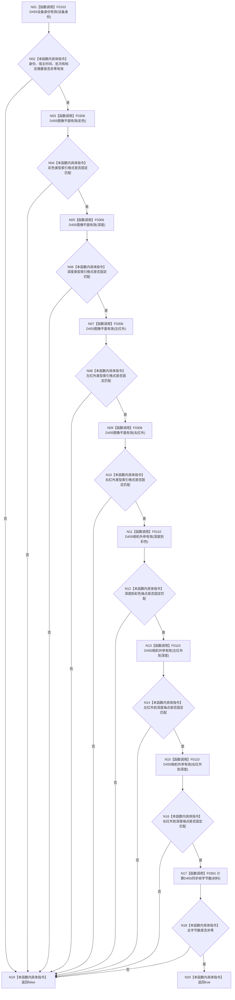

# CF-L4-0072 `D455同步帧材料有效` 现状流程图

图类型：现状流程图
代码版本：`a48a70b2d678dea64dd8228adb4f26f0badd9506`
覆盖文件：`海中鱼巣/适配/协议.D455采样材料.ixx:298-335`
唯一根函数：F0108
完整签名：`inline bool 海中鱼巣::D455同步帧材料有效(const 海中鱼巣::D455同步帧材料& 材料) noexcept`
参数：材料为非拥有只读引用；返回：全部身份、帧面、外参和字节数短路条件成立时 true

图中每个复合判断按源码从左到右短路；逐字段顺序见映射表。函数不验证四帧时间同步、内容一致性或标定来源，只验证当前结构字段。未解析调用 0。
