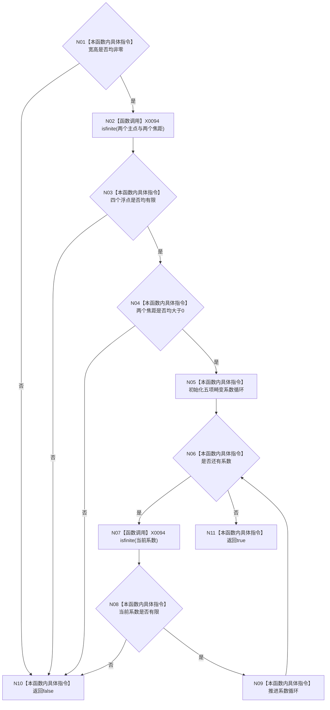

# CF-L4-0073 `D455相机内参有效` 现状流程图

图类型：现状流程图
代码版本：`a48a70b2d678dea64dd8228adb4f26f0badd9506`
覆盖文件：`海中鱼巣/适配/协议.D455采样材料.ixx:226-242`
唯一根函数：F0109
完整签名：`inline bool 海中鱼巣::D455相机内参有效(const 海中鱼巣::D455相机内参材料& 内参) noexcept`
参数：内参为非拥有只读引用；返回：最低数值条件全部成立时 true

项目调用 0；`std::isfinite` 和数组迭代统一登记 X0094。true 不证明主点位于图像内、焦距合理或畸变模型匹配。未解析调用 0。
