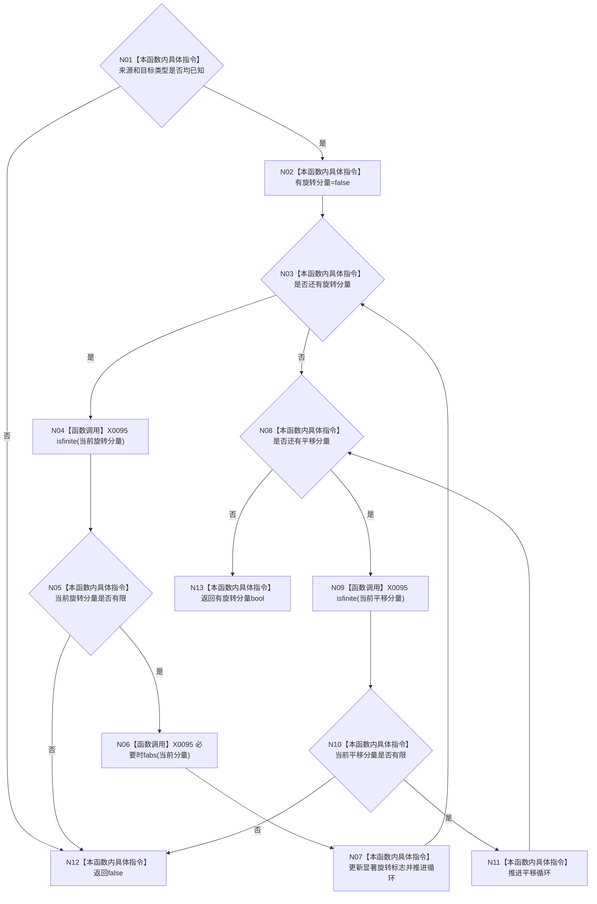

# CF-L4-0074 `D455相机外参有效` 现状流程图

图类型：现状流程图
代码版本：`a48a70b2d678dea64dd8228adb4f26f0badd9506`
覆盖文件：`海中鱼巣/适配/协议.D455采样材料.ixx:244-262`
唯一根函数：F0110
完整签名：`inline bool 海中鱼巣::D455相机外参有效(const 海中鱼巣::D455相机外参材料& 外参) noexcept`
参数：外参为非拥有只读引用；返回：类型已知、12 个分量有限且存在显著旋转分量时 true

找到显著旋转后，后续 `fabs` 短路但 `isfinite` 仍逐项执行。项目调用 0；数学和数组边界为 X0095。true 不证明旋转矩阵正交、行列式为正或平移处于物理范围。未解析调用 0。
