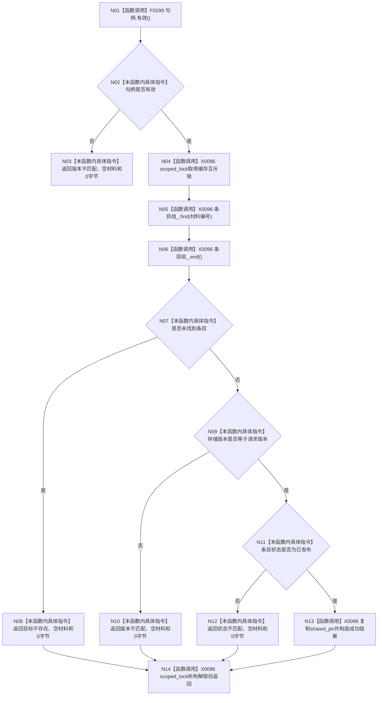

# CF-L4-0075 `D455帧材料缓存::按编号版本读取` 现状流程图

图类型：现状流程图
代码版本：`a48a70b2d678dea64dd8228adb4f26f0badd9506`
覆盖文件：`海中鱼巣/线程/缓存.D455帧材料.ixx:228-245`
唯一根函数：F0111
完整签名：`海中鱼巣::D455缓存读取结果 海中鱼巣::D455帧材料缓存::按编号版本读取(海中鱼巣::D455帧材料句柄 句柄) const`
参数：句柄按值传入；返回：结构化成功/追根因/拒绝原因、句柄、共享只读材料和字节数

项目调用 1：F0299。X0096 汇总互斥锁、无序映射和共享所有权外部边界。无效句柄在加锁前返回；其余读取在同一独占锁内完成。成功结果与缓存共同拥有不可变材料，不暴露条目或迭代器。未解析调用 0。
