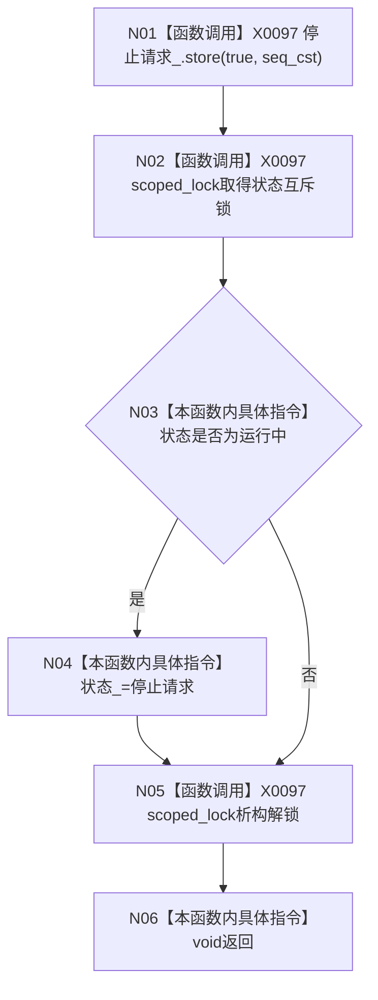

# CF-L4-0076 `D455相机采集器::请求停止` 现状流程图

图类型：现状流程图
代码版本：`a48a70b2d678dea64dd8228adb4f26f0badd9506`
覆盖文件：`海中鱼巣/适配/采集器.D455相机.ixx:690-696`
唯一根函数：F0112
完整签名：`void 海中鱼巣::D455相机采集器::请求停止() noexcept`
参数：无；返回：void；效果：发布停止请求，并在锁内把运行中状态转换为停止请求

项目调用 0。X0097 汇总原子 store 和互斥锁边界。原子停止标志严格先于尝试加锁；仅运行中状态被改写。本函数不关闭管线、不等待采样者、不返回停止确认。未解析调用 0。
