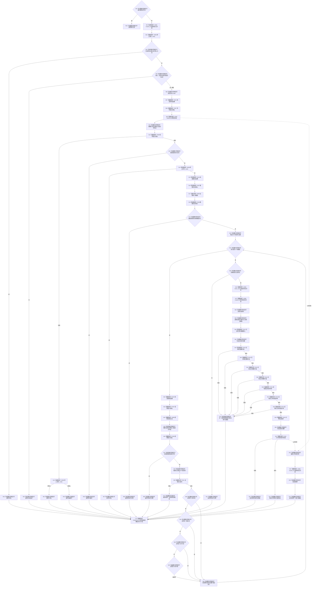

# CF-L4-0077 `D455相机采集器::采样一次` 现状流程图

图类型：现状流程图
代码版本：`a48a70b2d678dea64dd8228adb4f26f0badd9506`
覆盖文件：`海中鱼巣/适配/采集器.D455相机.ixx:590-688`
唯一根函数：F0113
完整签名：`海中鱼巣::D455采集结果 海中鱼巣::D455相机采集器::采样一次(std::uint32_t 超时毫秒)`
参数：超时毫秒按值传入；返回：结构化成功/追根因/拒绝原因和共享只读同步帧材料

项目被调函数 11 个唯一身份：F0307—F0316 与既有 F0108；其中 F0309/F0310 是隐式 RAII 回调。七次材料复制/外参读取严格左到右短路，不能合并成一次抽象处理。X0098 汇总 RealSense、原子、锁和标准智能指针边界。未解析调用 0。
