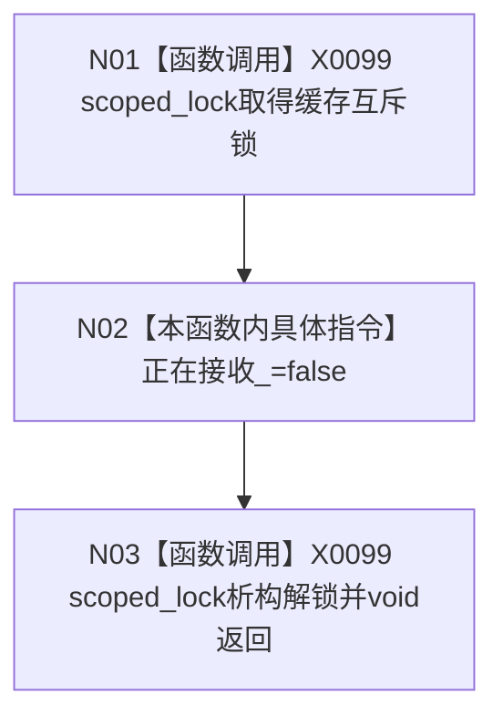

# CF-L4-0078 `D455帧材料缓存::停止接收` 现状流程图

图类型：现状流程图
代码版本：`a48a70b2d678dea64dd8228adb4f26f0badd9506`
覆盖文件：`海中鱼巣/线程/缓存.D455帧材料.ixx:290-293`
唯一根函数：F0114
完整签名：`void 海中鱼巣::D455帧材料缓存::停止接收() noexcept`
参数：无；返回：void；效果：锁内把接收门改为 false

项目调用 0。线性化点是 `正在接收_ = false`；重复调用幂等。它只禁止之后取得锁的新候选准备，不排空、不撤销、不清理既有条目，也不等待在途操作。未解析调用 0。
