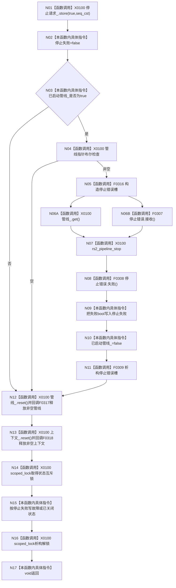

# CF-L4-0079 `D455相机采集器::关闭` 现状流程图

图类型：现状流程图
代码版本：`a48a70b2d678dea64dd8228adb4f26f0badd9506`
覆盖文件：`海中鱼巣/适配/采集器.D455相机.ixx:698-711`
唯一根函数：F0115
完整签名：`void 海中鱼巣::D455相机采集器::关闭() noexcept`
参数：无；返回：void；效果：请求停止、尝试停止 SDK 管线、释放管线和上下文并发布最终状态

项目调用 6 个唯一身份：F0316、F0307、F0308、F0309、F0317、F0318。管线和上下文是独占所有权，按管线后上下文顺序无条件释放；状态锁只覆盖最终状态写，不覆盖 SDK stop/reset。未解析调用 0。
