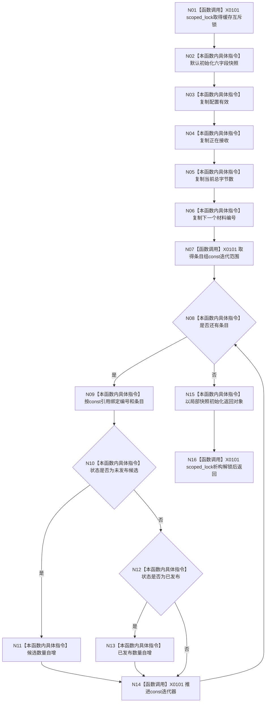

# CF-L4-0080 `D455帧材料缓存::读取缓存快照` 现状流程图

图类型：现状流程图
代码版本：`a48a70b2d678dea64dd8228adb4f26f0badd9506`
覆盖文件：`海中鱼巣/线程/缓存.D455帧材料.ixx:271-288`
唯一根函数：F0116
完整签名：`海中鱼巣::D455缓存快照 海中鱼巣::D455帧材料缓存::读取缓存快照() const`
参数：无；返回：同一锁内截面的六字段值快照

项目调用 0。函数只借用条目 const 引用，不复制或返回内部条目和材料；返回值是解锁后独立的标量快照。锁覆盖 O(n) 全表扫描。未解析调用 0。
