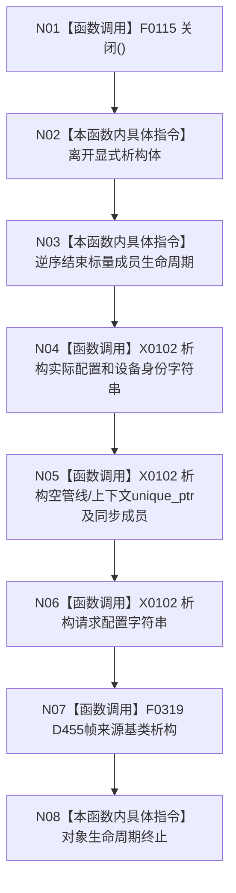

# CF-L4-0081 `D455相机采集器::~D455相机采集器` 现状流程图

图类型：现状流程图
代码版本：`a48a70b2d678dea64dd8228adb4f26f0badd9506`
覆盖文件：`海中鱼巣/适配/采集器.D455相机.ixx:431-433`，隐式析构顺序依据成员声明 `733-743` 与基类 `协议.D455采样材料.ixx:162`
唯一根函数：F0117
完整签名：`海中鱼巣::D455相机采集器::~D455相机采集器() noexcept`
参数：无显式参数；返回：无；效果：关闭采集器并逆序结束成员与基类生命周期

项目调用 2：F0115 和 F0319。关闭正常返回后管线与上下文已 reset，成员析构阶段的 unique_ptr 不再调用 SDK 删除器；它们仍提供异常状态兜底。析构不等待在途采样线程，调用方必须先证明对象静止。未解析调用 0。
