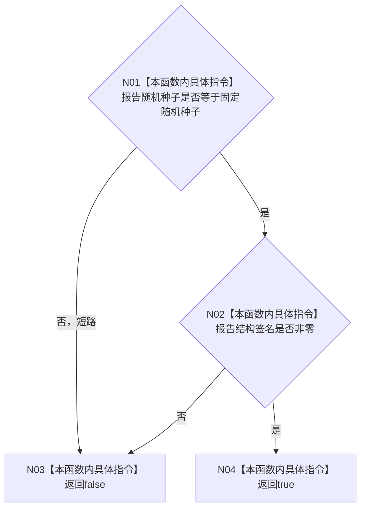

# CF-L4-0082 `性能报告固定种子与结构签名谓词` 现状流程图

图类型：现状流程图
代码版本：`a48a70b2d678dea64dd8228adb4f26f0badd9506`
覆盖文件：`海中鱼巣/核心/自检.关系仓库性能基线.ixx:893-895`
唯一根函数：F0118
完整签名：`bool 海中鱼巣::运行关系仓库性能基线自检()::<lambda@自检.关系仓库性能基线.ixx:893>::operator()<海中鱼巣::关系仓库性能基线内部::规模报告>(const 海中鱼巣::关系仓库性能基线内部::规模报告& 报告) const`
参数：报告为 all_of 当前元素的只读借用；返回：固定种子相等且结构签名非零时 true

项目调用 0，外部调用 0，未解析调用 0。外层 `std::all_of` 负责重复调用并在首个 false 处停止，不属于本函数体。true 只证明两个字段哨兵，不证明报告完整或结构签名正确。
