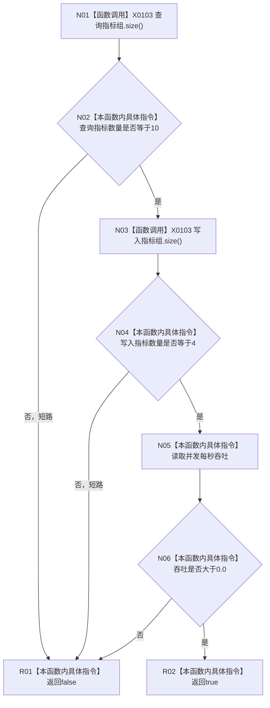

# CF-L4-0083 `性能报告指标数量与吞吐谓词` 现状流程图

图类型：现状流程图
代码版本：`a48a70b2d678dea64dd8228adb4f26f0badd9506`
覆盖文件：`海中鱼巣/核心/自检.关系仓库性能基线.ixx:912-916`
唯一根函数：F0119
完整签名：`bool 海中鱼巣::运行关系仓库性能基线自检()::<lambda@自检.关系仓库性能基线.ixx:912>::operator()<海中鱼巣::关系仓库性能基线内部::规模报告>(const 海中鱼巣::关系仓库性能基线内部::规模报告& 报告) const`
参数：报告为 all_of 当前元素的只读借用；返回：查询指标恰为10、写入指标恰为4且吞吐正数时 true

项目调用 0。X0103 是同一 `std::vector<分位指标>::size()` 身份的两个调用点。外层 all_of 的迭代和短路不属于本函数体。未解析调用 0。
