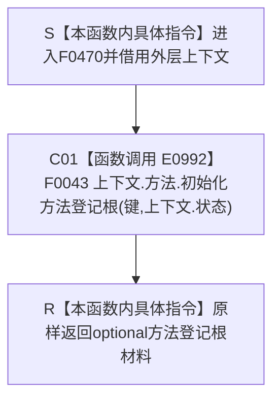

# CF-L4-0084 `概念图四根创建自检方法登记根 lambda` 现状流程图

图类型：现状流程图
代码版本：`0a93526882cb33c61c2fbb04ecad1aeaddcfe225`
源码 blob：`59de05d5ba3594942c819c9ec50e3d0ebc6cb9bd`
覆盖文件：`海中鱼巣/自检.入口初始化.ixx:81`
唯一根函数：F0470
完整签名：`std::optional<海中鱼巣::方法登记根材料> 海中鱼巣::运行概念图四根创建自检(const 海中鱼巣::入口初始化自检运行配置&)::<lambda@自检.入口初始化.ixx:81>::operator()(std::uint64_t 键) const`
参数：闭包按引用借用外层 `上下文`；`键` 按值传入；返回：原样返回方法登记根初始化结果
已登记调用方：F0015 经 E0986
直接项目函数：F0043/E0992
外部边界：无
未解析项目调用：无
调用图：`流程图/主程序可达调用关系/01_main可达项目调用边表.md`
逐行映射表：`流程图/代码流程图/L4/CF-L4-0084_概念图四根创建自检方法登记根lambda_逐行代码映射表.md`
依据：`规范/0600_代码函数流程图应用与维护规范.md`、当前代码与正式聚合关系表
不得作为施工许可：是

## 流程图

## 调用合同

| 调用边 | 节点 | 被调函数 | 实参与结果 | 当前作用 |
| --- | --- | --- | --- | --- |
| E0992 | C01 | F0043 `方法数据操作::初始化方法登记根` | `键`、`上下文.状态` → optional 材料 | 同步转接外层环境中的方法根初始化 |

当前图只记录 lambda 的同步转接事实；不宣称材料必然存在，也不把自检接线写成生产能力完成。
