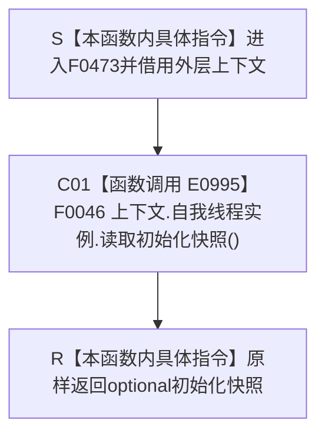

# CF-L4-0087 `概念图四根创建自检快照 lambda` 现状流程图

图类型：现状流程图
代码版本：`5cc7036de0decad163293a0b77c4789f068fd73a`
源码 blob：`95681cdeef7ab705cf391738b05b36ca4fafc608`
覆盖文件：`海中鱼巣/自检.入口初始化.ixx:83`
唯一根函数：F0473
完整签名：`std::optional<海中鱼巣::自我线程初始化快照> 海中鱼巣::运行概念图四根创建自检(const 海中鱼巣::入口初始化自检运行配置&)::<lambda@自检.入口初始化.ixx:83>::operator()() const`
参数：无显式参数；闭包按引用借用外层 `上下文`；返回：原样返回初始化快照
已登记调用方：F0015 经 E0989
直接项目函数：F0046/E0995
外部边界：无；未解析项目调用：无
逐行映射表：`流程图/代码流程图/L4/CF-L4-0087_概念图四根创建自检快照lambda_逐行代码映射表.md`
不得作为施工许可：是

项目调用 1；空 optional 是被调读取结果，本函数不构造替代快照。
