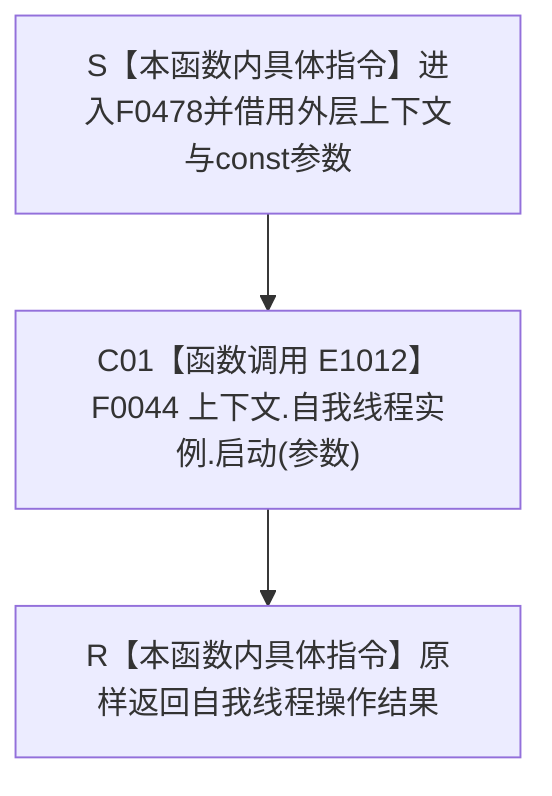

# CF-L4-0091 `概念图四根唯一自检启动 lambda` 现状流程图

图类型：现状流程图
代码版本：`5c5dbc536a250b080bf6045bf4c4e556730b1b7d`
源码 blob：`95681cdeef7ab705cf391738b05b36ca4fafc608`
覆盖文件：`海中鱼巣/自检.入口初始化.ixx:110`
唯一根函数：F0478
完整签名：`海中鱼巣::自我线程操作结果 海中鱼巣::运行概念图四根唯一自检(const 海中鱼巣::入口初始化自检运行配置&)::<lambda@自检.入口初始化.ixx:110>::operator()(const 海中鱼巣::自我根需求初始化参数& 参数) const`
参数：闭包按引用借用外层 `上下文`；`参数` 为 const 引用；返回：原样返回自我线程启动结果
已登记调用方：F0015 经 E1006
直接项目函数：F0044/E1012
外部边界：无；未解析项目调用：无
逐行映射表：`流程图/代码流程图/L4/CF-L4-0091_概念图四根唯一自检启动lambda_逐行代码映射表.md`
不得作为施工许可：是

项目调用 1；本函数只同步转接启动请求，不把自检调用写成线程必然成功或能力完成。
