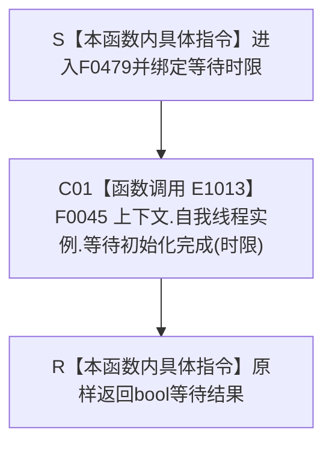

# CF-L4-0092 `概念图四根唯一自检等待 lambda` 现状流程图

图类型：现状流程图
代码版本：`0a93526882cb33c61c2fbb04ecad1aeaddcfe225`
源码 blob：`59de05d5ba3594942c819c9ec50e3d0ebc6cb9bd`
覆盖文件：`海中鱼巣/自检.入口初始化.ixx:112`
唯一根函数：F0479
完整签名：`bool 海中鱼巣::运行概念图四根唯一自检(const 海中鱼巣::入口初始化自检运行配置&)::<lambda@自检.入口初始化.ixx:112>::operator()(std::chrono::milliseconds 时限) const`
参数：闭包按引用借用外层 `上下文`；`时限` 按值传入；返回：原样返回等待结果
已登记调用方：F0015 经 E1007
直接项目函数：F0045/E1013
外部边界：无；未解析项目调用：无
逐行映射表：`流程图/代码流程图/L4/CF-L4-0092_概念图四根唯一自检等待lambda_逐行代码映射表.md`
不得作为施工许可：是

项目调用 1；false 的具体原因由 F0045 的当前实现决定，本函数不追加状态。
