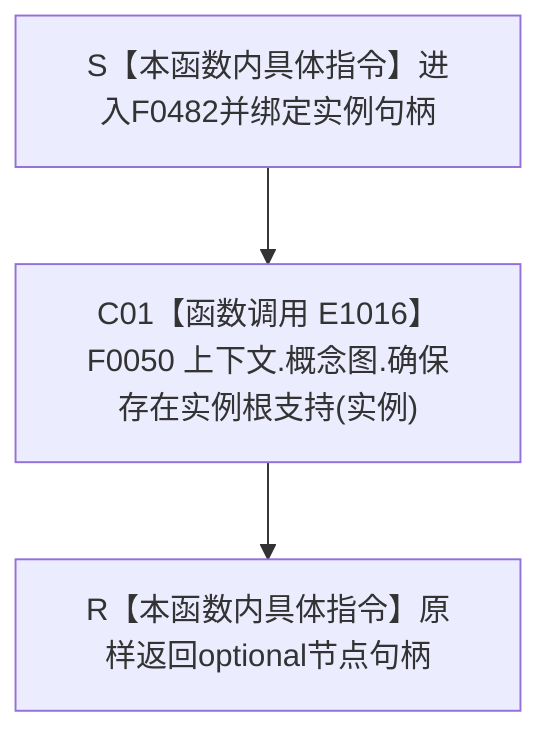

# CF-L4-0095 `概念图四根唯一自检读取归属 lambda` 现状流程图

图类型：现状流程图
代码版本：`0a93526882cb33c61c2fbb04ecad1aeaddcfe225`
源码 blob：`59de05d5ba3594942c819c9ec50e3d0ebc6cb9bd`
覆盖文件：`海中鱼巣/自检.入口初始化.ixx:115`
唯一根函数：F0482
完整签名：`std::optional<海中鱼巣::节点句柄> 海中鱼巣::运行概念图四根唯一自检(const 海中鱼巣::入口初始化自检运行配置&)::<lambda@自检.入口初始化.ixx:115>::operator()(海中鱼巣::节点句柄 实例) const`
参数：闭包按引用借用外层 `上下文`；`实例` 按值传入；返回：原样返回实例根支持句柄
已登记调用方：F0015 经 E1010
直接项目函数：F0050/E1016
外部边界：无；未解析项目调用：无
逐行映射表：`流程图/代码流程图/L4/CF-L4-0095_概念图四根唯一自检读取归属lambda_逐行代码映射表.md`
不得作为施工许可：是

项目调用 1；函数名中的“确保”来自当前被调身份，不等于本 lambda 自身完成结构写入。
