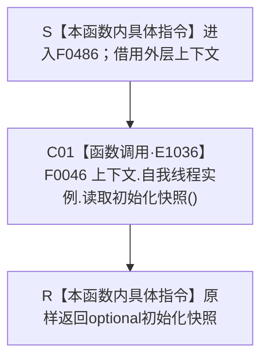

# CF-L4-0099 `概念图非名称身份自检快照 lambda` 现状流程图

图类型：现状流程图
代码版本：`0a93526882cb33c61c2fbb04ecad1aeaddcfe225`
源码 blob：`59de05d5ba3594942c819c9ec50e3d0ebc6cb9bd`
覆盖文件：`海中鱼巣/自检.入口初始化.ixx:141`
唯一根函数：F0486
完整签名：`std::optional<海中鱼巣::自我线程初始化快照> 海中鱼巣::运行概念图非名称身份自检(const 海中鱼巣::入口初始化自检运行配置&)::<lambda@自检.入口初始化.ixx:141>::operator()() const`
参数：无显式参数；闭包按引用借用外层 `上下文`，不得逃逸外层作用域
返回结果：原样返回 F0046 形成的 `std::optional<自我线程初始化快照>`
已登记调用方：F0015 经 E1030
直接项目函数：F0046 经 E1036
外部边界：无
未解析项目调用：无
调用图：`流程图/主程序可达调用关系/01_main可达项目调用边表.md`
逐行映射表：`流程图/代码流程图/L4/CF-L4-0099_概念图非名称身份自检快照lambda_逐行代码映射表.md`
输入契约 / 调用语境表：本文“调用合同与边界”
非成功返回二分审查表：本文“调用合同与边界”
偏差清单：无；项目调用已由 E1036 登记
依据提交 / 结构化消息：当前 HEAD `5c5dbc536a250b080bf6045bf4c4e556730b1b7d` 与正式聚合关系表
验证输出：第 141 行完整映射；1 个项目入边、1 个项目出边、0 个外部边界、0 个未解析调用
依据：`规范/0050_项目通用机器逻辑与禁止性规则总纲_20260721.md`、`规范/0600_代码函数流程图应用与维护规范.md`
不得作为施工许可：是
不得宣称：optional 有值证明概念图初始化成功、四根材料完整或生产能力已经完成

## 流程图

## 调用合同与边界

| 调用边 | 节点 | 实参与结果 | 非成功口径 | 结构变化 |
| --- | --- | --- | --- | --- |
| E1036 | C01 | 无显式实参 → optional 初始化快照 | 空 optional 由 F0046 决定并原样传播 | 无；本 lambda 只读取并返回 |

本函数不构造替代快照，也不把快照内容升格为独立机器事实。
