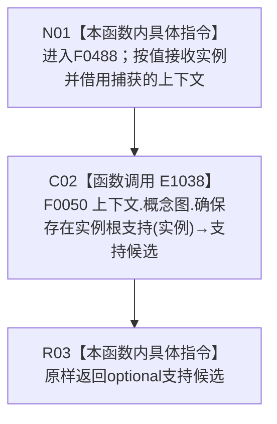

# CF-L4-0101 概念图非名称身份自检读取归属 lambda 现状流程图

图类型：现状流程图
代码版本：`5c5dbc536a250b080bf6045bf4c4e556730b1b7d`
源码 blob：`95681cdeef7ab705cf391738b05b36ca4fafc608`
覆盖文件：`海中鱼巣/自检.入口初始化.ixx:142`
唯一根函数：F0488
完整签名：`std::optional<海中鱼巣::节点句柄> 海中鱼巣::运行概念图非名称身份自检(const 海中鱼巣::入口初始化自检运行配置&)::<lambda@自检.入口初始化.ixx:142>::operator()(海中鱼巣::节点句柄 实例) const`
参数：`实例` 按值传入；lambda 通过 `[&]` 非拥有引用捕获外层 `上下文`
返回结果：原样返回 F0050 的 `std::optional<节点句柄>`；空 optional 与有值 optional 的语义由被调函数裁决
调用图：`流程图/主程序可达调用关系/01_main可达项目调用边表.md`
逐行映射表：`流程图/代码流程图/L4/CF-L4-0101_概念图非名称身份自检读取归属lambda_逐行代码映射表.md`
输入契约 / 调用语境表：本文“调用与返回边界”
非成功返回二分审查表：本文“调用与返回边界”
偏差清单：无；本文只冻结当前代码事实
依据提交 / 结构化消息：当前提交、F0488、E1038 与源码第 142 行交叉复核
验证输出：1 行定义完整映射；1 个项目出边；0 个外部边界；0 个未解析调用
不得作为施工许可：是
不得宣称：optional 有值证明概念图全部根身份完整；optional 为空唯一证明实例不存在

## 函数合同

```text
根函数：F0488 概念图非名称身份自检读取归属 lambda
归属模块 / 文件 / 层级：自检.入口初始化 / 海中鱼巣/自检.入口初始化.ixx / L4
现有或待新增：现有局部 lambda
完整签名：std::optional<节点句柄> operator()(节点句柄 实例) const
参数：实例按值；上下文按引用捕获且不取得所有权
返回结果：原样转发 F0050 的 optional 节点句柄
被调函数流程图：流程图/代码流程图/L4/CF-L4-0014_概念图服务_确保存在实例根支持_现状流程图.md
```

## 流程图



## 节点合同

| 节点 | 类型 | 参数 / 输入绑定 | 结果 / 输出绑定 | 事实读写 | 后继条件 |
| --- | --- | --- | --- | --- | --- |
| N01 | 本函数内具体指令 | `实例`、引用捕获的 `上下文` | 进入同步转发 | 无 | 无条件 |
| C02 | 函数调用 | `上下文.概念图` → 隐式 this；`实例` → F0050 形参 | optional 节点句柄 → 支持候选 | 由 F0050 裁决 | 调用完成 |
| R03 | 本函数内具体指令 | 支持候选 | 原样返回 | 无新增写入 | 函数结束 |

## 调用与返回边界

- lambda 不保存 `实例` 或 `上下文`，其引用捕获只在外层自检环境和端口的有效生命周期内使用。
- 空 optional 是 F0050 的逻辑内返回透传；本 lambda 不增加错误映射或结构变化。
