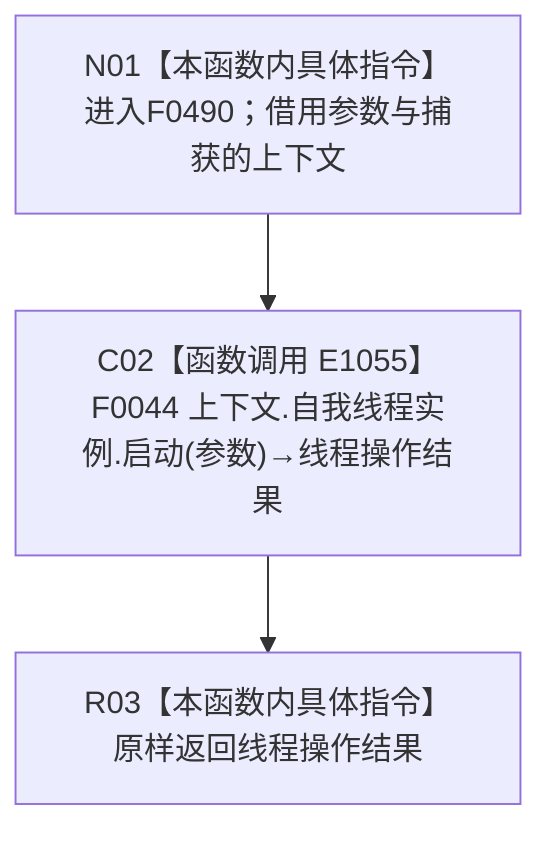

# CF-L4-0103 概念图根名绑定自检启动 lambda 现状流程图

图类型：现状流程图
代码版本：`5c5dbc536a250b080bf6045bf4c4e556730b1b7d`
源码 blob：`95681cdeef7ab705cf391738b05b36ca4fafc608`
覆盖文件：`海中鱼巣/自检.入口初始化.ixx:167`
唯一根函数：F0490
完整签名：`海中鱼巣::自我线程操作结果 海中鱼巣::运行概念图根名绑定自检(const 海中鱼巣::入口初始化自检运行配置&)::<lambda@自检.入口初始化.ixx:167>::operator()(const 海中鱼巣::自我根需求初始化参数& 参数) const`
参数：`参数` 以 const 引用借用且只覆盖同步调用；lambda 通过 `[&]` 非拥有引用捕获外层 `上下文`
返回结果：原样返回 F0044 的 `自我线程操作结果`
调用图：`流程图/主程序可达调用关系/01_main可达项目调用边表.md`
逐行映射表：`流程图/代码流程图/L4/CF-L4-0103_概念图根名绑定自检启动lambda_逐行代码映射表.md`
输入契约 / 调用语境表：本文“调用与返回边界”
非成功返回二分审查表：本文“调用与返回边界”
偏差清单：无；本文只冻结当前代码事实
依据提交 / 结构化消息：当前提交、F0490、E1055 与源码第 167 行交叉复核
验证输出：1 行定义完整映射；1 个项目出边；0 个外部边界；0 个未解析调用
不得作为施工许可：是
不得宣称：返回成功证明自我循环、自我苏醒或系统初始化已经完成

## 函数合同

```text
根函数：F0490 概念图根名绑定自检启动 lambda
归属模块 / 文件 / 层级：自检.入口初始化 / 海中鱼巣/自检.入口初始化.ixx / L4
现有或待新增：现有局部 lambda
完整签名：自我线程操作结果 operator()(const 自我根需求初始化参数& 参数) const
参数：参数为同步 const 引用借用；上下文按引用捕获
返回结果：原样转发 F0044 的操作结果
被调函数流程图：流程图/代码流程图/L4/CF-L4-0008_自我线程_启动_现状流程图.md
```

## 流程图



## 节点合同

| 节点 | 类型 | 参数 / 输入绑定 | 结果 / 输出绑定 | 事实读写 | 后继条件 |
| --- | --- | --- | --- | --- | --- |
| N01 | 本函数内具体指令 | const 参数引用、引用捕获的上下文 | 进入同步转发 | 无 | 无条件 |
| C02 | 函数调用 | `上下文.自我线程实例` → 隐式 this；参数 → F0044 形参 | 自我线程操作结果 | 由 F0044 承载 | 调用完成 |
| R03 | 本函数内具体指令 | 线程操作结果 | 原样返回 | 无新增写入 | 函数结束 |

## 调用与返回边界

- 本 lambda 不保存参数引用，启动行为、拒绝和内部错误均由 F0044 承载。
- 本 lambda 只是自检端口适配，不把线程操作结果升级为能力完成事实。
