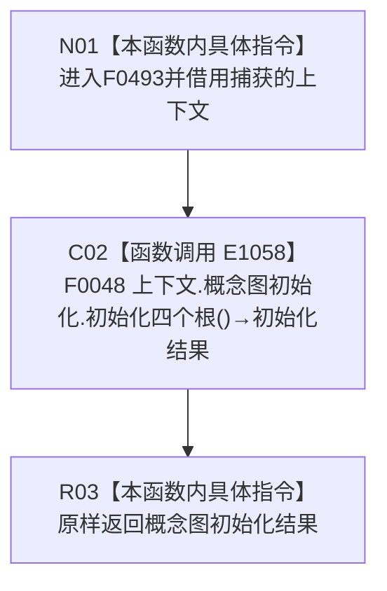

# CF-L4-0106 概念图根名绑定自检初始化四根 lambda 现状流程图

图类型：现状流程图
代码版本：`5c5dbc536a250b080bf6045bf4c4e556730b1b7d`
源码 blob：`95681cdeef7ab705cf391738b05b36ca4fafc608`
覆盖文件：`海中鱼巣/自检.入口初始化.ixx:170`
唯一根函数：F0493
完整签名：`海中鱼巣::概念图初始化结果 海中鱼巣::运行概念图根名绑定自检(const 海中鱼巣::入口初始化自检运行配置&)::<lambda@自检.入口初始化.ixx:170>::operator()() const`
参数：无显式参数；lambda 通过 `[&]` 非拥有引用捕获外层 `上下文`
返回结果：原样返回 F0048 的 `概念图初始化结果`
调用图：`流程图/主程序可达调用关系/01_main可达项目调用边表.md`
逐行映射表：`流程图/代码流程图/L4/CF-L4-0106_概念图根名绑定自检初始化四根lambda_逐行代码映射表.md`
依据提交 / 结构化消息：当前提交、F0493、E1058 与源码第 170 行交叉复核
验证输出：1 行定义完整映射；1 个项目出边；0 个外部边界；0 个未解析调用
不得作为施工许可：是
不得宣称：转发初始化调用证明根结构已创建、生产接线完成或能力闭环

项目调用 1；结构变化、拒绝和内部错误口径均由 F0048 承载。
