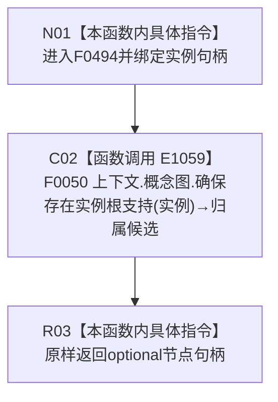

# CF-L4-0107 概念图根名绑定自检读取归属 lambda 现状流程图

图类型：现状流程图
代码版本：`5c5dbc536a250b080bf6045bf4c4e556730b1b7d`
源码 blob：`95681cdeef7ab705cf391738b05b36ca4fafc608`
覆盖文件：`海中鱼巣/自检.入口初始化.ixx:171`
唯一根函数：F0494
完整签名：`std::optional<海中鱼巣::节点句柄> 海中鱼巣::运行概念图根名绑定自检(const 海中鱼巣::入口初始化自检运行配置&)::<lambda@自检.入口初始化.ixx:171>::operator()(海中鱼巣::节点句柄 实例) const`
参数：`实例` 按值传入；lambda 通过 `[&]` 非拥有引用捕获外层 `上下文`
返回结果：原样返回 F0050 的 `std::optional<节点句柄>`
调用图：`流程图/主程序可达调用关系/01_main可达项目调用边表.md`
逐行映射表：`流程图/代码流程图/L4/CF-L4-0107_概念图根名绑定自检读取归属lambda_逐行代码映射表.md`
依据提交 / 结构化消息：当前提交、F0494、E1059 与源码第 171 行交叉复核
验证输出：1 行定义完整映射；1 个项目出边；0 个外部边界；0 个未解析调用
不得作为施工许可：是
不得宣称：optional 有值、实例归属已确认、生产接线完成或能力闭环

项目调用 1；函数名中的“确保”属于 F0050 的当前身份，不等于本 lambda 自身完成结构写入。
