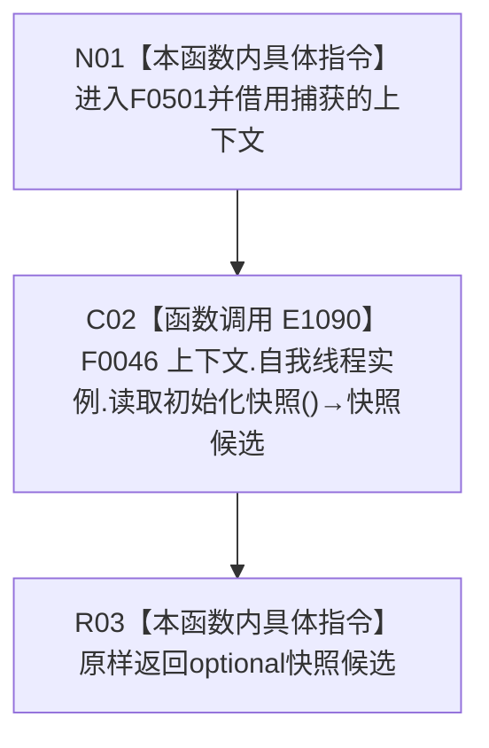

# CF-L4-0111 概念图重复初始化结构不变自检快照 lambda 现状流程图

图类型：现状流程图
代码版本：`45786c8e1ed2cec34b4fd32924cda16d643be7a1`
源码 blob：`95681cdeef7ab705cf391738b05b36ca4fafc608`
覆盖文件：`海中鱼巣/自检.入口初始化.ixx:202`
唯一根函数：F0501
完整签名：`std::optional<海中鱼巣::自我线程初始化快照> 海中鱼巣::运行概念图重复初始化结构不变自检(const 海中鱼巣::入口初始化自检运行配置&)::<lambda@自检.入口初始化.ixx:202>::operator()() const`
参数：无显式参数；lambda 通过 `[&]` 非拥有引用捕获外层 `上下文`
返回结果：原样返回 F0046 的 `std::optional<自我线程初始化快照>`
已登记调用方：F0015 经 E1084
直接项目函数：F0046/E1090
外部边界：无；未解析项目调用：无
调用图：`流程图/主程序可达调用关系/01_main可达项目调用边表.md`
逐行映射表：`流程图/代码流程图/L4/CF-L4-0111_概念图重复初始化结构不变自检快照lambda_逐行代码映射表.md`
输入契约 / 调用语境表：本文“调用与返回边界”
非成功返回二分审查表：本文“调用与返回边界”
偏差清单：无；本文只冻结当前代码事实
依据提交 / 结构化消息：当前提交、F0501、E1084、E1090 与源码第 202 行交叉复核
验证输出：1 行定义完整映射；1 个项目入边；1 个项目出边；0 个外部边界；0 个未解析调用
不得作为施工许可：是
不得宣称：返回快照证明后续状态持续有效、生产接线完成或重复初始化结构不变

## 函数合同

```text
根函数：F0501 概念图重复初始化结构不变自检快照 lambda
归属模块 / 文件 / 层级：自检.入口初始化 / 海中鱼巣/自检.入口初始化.ixx / L4
现有或待新增：现有局部 lambda
完整签名：std::optional<自我线程初始化快照> operator()() const
参数：无显式参数；上下文按引用捕获
返回结果：原样转发 F0046 的 optional 快照
被调函数流程图：流程图/代码流程图/L4/CF-L4-0010_自我线程_读取初始化快照_现状流程图.md
```

## 流程图



## 节点合同

| 节点 | 类型 | 参数 / 输入绑定 | 结果 / 输出绑定 | 事实读写 | 后继条件 |
| --- | --- | --- | --- | --- | --- |
| N01 | 本函数内具体指令 | 引用捕获的上下文 | 进入同步转发 | 无 | 无条件 |
| C02 | 函数调用 | `上下文.自我线程实例` → 隐式 this；无显式实参 | optional 初始化快照 | 由 F0046 承载 | 调用完成 |
| R03 | 本函数内具体指令 | 快照候选 | 原样返回 | 无新增写入 | 函数结束 |

## 调用与返回边界

- E1084 由 F0015 在读取初始化快照回调位置调用本闭包；本图不展开 F0015。
- 空 optional 与有值 optional 的语义由 F0046 裁决，本 lambda 不增加分支或事实写入。
