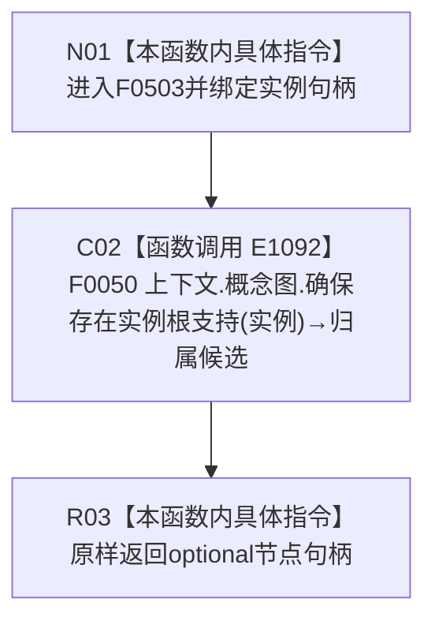

# CF-L4-0113 概念图重复初始化结构不变自检读取归属 lambda 现状流程图

图类型：现状流程图
代码版本：`0a93526882cb33c61c2fbb04ecad1aeaddcfe225`
源码 blob：`59de05d5ba3594942c819c9ec50e3d0ebc6cb9bd`
覆盖文件：`海中鱼巣/自检.入口初始化.ixx:205`
唯一根函数：F0503
完整签名：`std::optional<海中鱼巣::节点句柄> 海中鱼巣::运行概念图重复初始化结构不变自检(const 海中鱼巣::入口初始化自检运行配置&)::<lambda@自检.入口初始化.ixx:205>::operator()(海中鱼巣::节点句柄 实例) const`
参数：`实例` 按值传入；lambda 通过 `[&]` 非拥有引用捕获外层 `上下文`
返回结果：原样返回 F0050 的 `std::optional<节点句柄>`
已登记调用方：F0015 经 E1086
直接项目函数：F0050/E1092
外部边界：无；未解析项目调用：无
调用图：`流程图/主程序可达调用关系/01_main可达项目调用边表.md`
逐行映射表：`流程图/代码流程图/L4/CF-L4-0113_概念图重复初始化结构不变自检读取归属lambda_逐行代码映射表.md`
输入契约 / 调用语境表：本文“调用与返回边界”
非成功返回二分审查表：本文“调用与返回边界”
偏差清单：无；本文只冻结当前代码事实
依据提交 / 结构化消息：当前提交、F0503、E1086、E1092 与源码第 205 行交叉复核
验证输出：1 行定义完整映射；1 个项目入边；1 个项目出边；0 个外部边界；0 个未解析调用
不得作为施工许可：是
不得宣称：optional 有值、实例归属已确认、生产接线完成或重复初始化结构不变

## 函数合同

```text
根函数：F0503 概念图重复初始化结构不变自检读取归属 lambda
归属模块 / 文件 / 层级：自检.入口初始化 / 海中鱼巣/自检.入口初始化.ixx / L4
现有或待新增：现有局部 lambda
完整签名：std::optional<节点句柄> operator()(节点句柄 实例) const
参数：实例按值；上下文按引用捕获
返回结果：原样转发 F0050 的 optional 节点句柄
被调函数流程图：流程图/代码流程图/L4/CF-L4-0014_概念图服务_确保存在实例根支持_现状流程图.md
```

## 流程图



## 节点合同

| 节点 | 类型 | 参数 / 输入绑定 | 结果 / 输出绑定 | 事实读写 | 后继条件 |
| --- | --- | --- | --- | --- | --- |
| N01 | 本函数内具体指令 | 实例句柄、引用捕获的上下文 | 进入同步转发 | 无 | 无条件 |
| C02 | 函数调用 | `上下文.概念图` → 隐式 this；实例 → F0050 形参 | optional 节点句柄 | 由 F0050 承载 | 调用完成 |
| R03 | 本函数内具体指令 | 归属候选 | 原样返回 | 无新增写入 | 函数结束 |

## 调用与返回边界

- E1086 由 F0015 在存在实例根支持回调位置调用本闭包；本图不展开 F0015。
- 函数名中的“确保”属于 F0050 的当前身份；本 lambda 不直接写结构，不把 optional 有值升级为归属确认事实。
