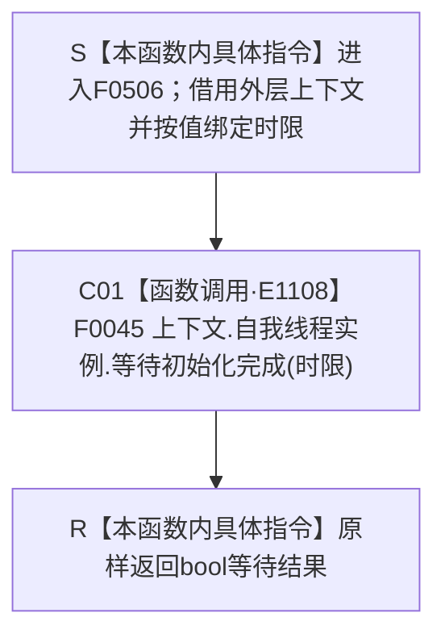

# CF-L4-0116 `自我存在实例根支持自检等待 lambda` 现状流程图

图类型：现状流程图
代码版本：`45786c8e1ed2cec34b4fd32924cda16d643be7a1`
源码 blob：`95681cdeef7ab705cf391738b05b36ca4fafc608`
覆盖文件：`海中鱼巣/自检.入口初始化.ixx:233`
唯一根函数：F0506
完整签名：`bool 海中鱼巣::运行自我存在实例根支持自检(const 海中鱼巣::入口初始化自检运行配置&)::<lambda@自检.入口初始化.ixx:233>::operator()(std::chrono::milliseconds 时限) const`
参数：闭包按引用借用外层 `上下文`，不得逃逸外层作用域；`时限` 按值传入
返回结果：原样返回 F0045 的 bool 等待结果
已登记调用方：F0015 经 E1102
直接项目函数：F0045 经 E1108
外部边界：无
未解析项目调用：无
调用图：`流程图/主程序可达调用关系/01_main可达项目调用边表.md`
逐行映射表：`流程图/代码流程图/L4/CF-L4-0116_自我存在实例根支持自检等待lambda_逐行代码映射表.md`
输入契约 / 调用语境表：本文“调用合同与边界”
非成功返回二分审查表：本文“调用合同与边界”
偏差清单：无；项目调用已由 E1108 登记
依据提交 / 结构化消息：当前 HEAD `45786c8e1ed2cec34b4fd32924cda16d643be7a1` 与正式聚合关系表
验证输出：第 233 行完整映射；1 个项目入边、1 个项目出边、0 个外部边界、0 个未解析调用
依据：`规范/0050_项目通用机器逻辑与禁止性规则总纲_20260721.md`、`规范/0600_代码函数流程图应用与维护规范.md`
不得作为施工许可：是
不得宣称：bool 为 true 证明自我存在实例根支持已经形成或生产能力已经完成

## 流程图

## 调用合同与边界

| 调用边 | 节点 | 实参与结果 | 非成功口径 | 结构变化 |
| --- | --- | --- | --- | --- |
| E1108 | C01 | `时限` → bool 等待结果 | false 的具体原因由 F0045 决定并原样传播 | 无；本 lambda 只等待和返回 |

本函数不追加状态，不把 false 推断为单一超时原因。
