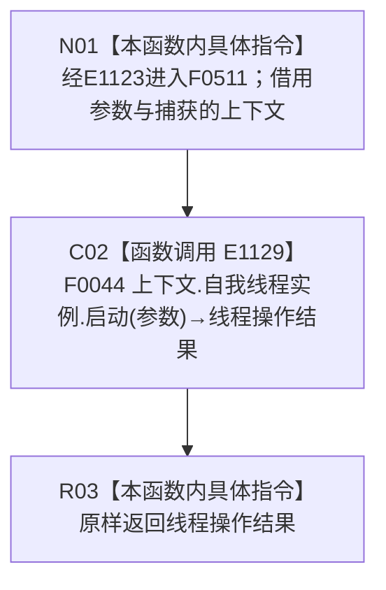

# CF-L4-0121 多存在实例根支持自检启动 lambda 现状流程图

图类型：现状流程图
代码版本：`45786c8e1ed2cec34b4fd32924cda16d643be7a1`
源码 blob：`95681cdeef7ab705cf391738b05b36ca4fafc608`
覆盖文件：`海中鱼巣/自检.入口初始化.ixx:256`
唯一根函数：F0511
完整签名：`海中鱼巣::自我线程操作结果 海中鱼巣::运行多存在实例根支持自检(const 海中鱼巣::入口初始化自检运行配置&)::<lambda@自检.入口初始化.ixx:256>::operator()(const 海中鱼巣::自我根需求初始化参数& 参数) const`
参数：`参数` 以 const 引用同步借用；lambda 通过 `[&]` 非拥有引用捕获外层 `上下文`
返回结果：原样返回 F0044 的 `自我线程操作结果`
已登记调用方：F0015 经 E1123 回调调用
直接项目函数：E1129 调用 F0044
外部边界：无
调用图：`流程图/主程序可达调用关系/01_main可达项目调用边表.md`
逐行映射表：`流程图/代码流程图/L4/CF-L4-0121_多存在实例根支持自检启动lambda_逐行代码映射表.md`
偏差清单：无；本文只冻结当前代码事实
依据提交 / 结构化消息：当前提交、F0511、E1123、E1129 与源码第 256 行交叉复核
验证输出：1 行定义完整映射；1 个项目入边、1 个项目出边、0 个外部边界、0 个未解析调用
不得作为施工许可：是
不得宣称：操作结果成功证明自我循环、自我苏醒、多实例支持或系统初始化完成

## 函数合同

```text
根函数：F0511 多存在实例根支持自检启动 lambda
归属模块 / 文件 / 层级：自检.入口初始化 / 海中鱼巣/自检.入口初始化.ixx / L4
现有或待新增：现有局部 lambda
参数：参数为同步 const 引用；上下文按引用捕获
返回结果：原样转发 F0044 的自我线程操作结果
被调函数流程图：流程图/代码流程图/L4/CF-L4-0008_自我线程_启动_现状流程图.md
```

## 流程图



## 节点合同

| 节点 | 类型 | 输入绑定 | 输出绑定 | 事实读写 | 后继 |
| --- | --- | --- | --- | --- | --- |
| N01 | 本函数内具体指令 | E1123 传入参数；引用捕获上下文 | 进入同步转发 | 无 | C02 |
| C02 | 函数调用 | 自我线程实例、参数 | F0044 操作结果 | 由 F0044 承载 | R03 |
| R03 | 本函数内具体指令 | 线程操作结果 | 原样返回 | 无新增写入 | 结束 |

## 当前边界

- 本 lambda 不保存参数引用；启动拒绝和内部错误均由 F0044 形成并原样返回。
- 本 lambda 只是自检端口适配，不把返回状态升级为能力完成事实。
