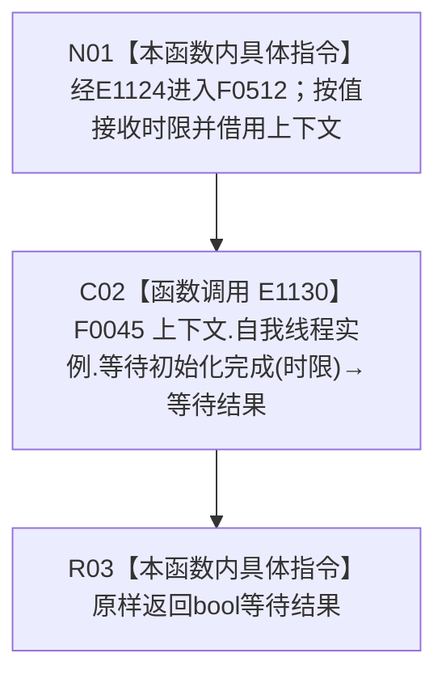

# CF-L4-0122 多存在实例根支持自检等待 lambda 现状流程图

图类型：现状流程图
代码版本：`45786c8e1ed2cec34b4fd32924cda16d643be7a1`
源码 blob：`95681cdeef7ab705cf391738b05b36ca4fafc608`
覆盖文件：`海中鱼巣/自检.入口初始化.ixx:257`
唯一根函数：F0512
完整签名：`bool 海中鱼巣::运行多存在实例根支持自检(const 海中鱼巣::入口初始化自检运行配置&)::<lambda@自检.入口初始化.ixx:257>::operator()(std::chrono::milliseconds 时限) const`
参数：`时限` 按值传入；lambda 通过 `[&]` 非拥有引用捕获外层 `上下文`
返回结果：原样返回 F0045 的 bool 等待结果
已登记调用方：F0015 经 E1124 回调调用
直接项目函数：E1130 调用 F0045
外部边界：无
调用图：`流程图/主程序可达调用关系/01_main可达项目调用边表.md`
逐行映射表：`流程图/代码流程图/L4/CF-L4-0122_多存在实例根支持自检等待lambda_逐行代码映射表.md`
偏差清单：无；本文只冻结当前代码事实
依据提交 / 结构化消息：当前提交、F0512、E1124、E1130 与源码第 257 行交叉复核
验证输出：1 行定义完整映射；1 个项目入边、1 个项目出边、0 个外部边界、0 个未解析调用
不得作为施工许可：是
不得宣称：返回 `true` 证明后续系统能力完成；返回 `false` 唯一证明内部错误

## 函数合同

```text
根函数：F0512 多存在实例根支持自检等待 lambda
归属模块 / 文件 / 层级：自检.入口初始化 / 海中鱼巣/自检.入口初始化.ixx / L4
现有或待新增：现有局部 lambda
参数：时限按值；上下文按引用捕获
返回结果：原样转发 F0045 的 bool
被调函数流程图：流程图/代码流程图/L4/CF-L4-0009_自我线程_等待初始化完成_现状流程图.md
```

## 流程图



## 节点合同

| 节点 | 类型 | 输入绑定 | 输出绑定 | 事实读写 | 后继 |
| --- | --- | --- | --- | --- | --- |
| N01 | 本函数内具体指令 | E1124 传入时限；引用捕获上下文 | 进入同步转发 | 无 | C02 |
| C02 | 函数调用 | 自我线程实例、时限 | F0045 bool | 由 F0045 承载 | R03 |
| R03 | 本函数内具体指令 | 等待结果 | 原样返回 | 无新增写入 | 结束 |

## 当前边界

- true / false 的等待语义由 F0045 形成；本 lambda 不区分超时、拒绝或其它原因。
- 本 lambda 不修改时限、线程状态或自检环境。
