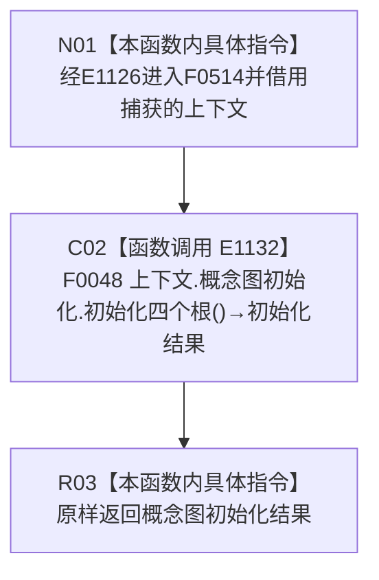

# CF-L4-0124 多存在实例根支持自检概念图初始化 lambda 现状流程图

图类型：现状流程图
代码版本：`45786c8e1ed2cec34b4fd32924cda16d643be7a1`
源码 blob：`95681cdeef7ab705cf391738b05b36ca4fafc608`
覆盖文件：`海中鱼巣/自检.入口初始化.ixx:259`
唯一根函数：F0514
完整签名：`海中鱼巣::概念图初始化结果 海中鱼巣::运行多存在实例根支持自检(const 海中鱼巣::入口初始化自检运行配置&)::<lambda@自检.入口初始化.ixx:259>::operator()() const`
参数：无显式参数；lambda 通过 `[&]` 非拥有引用捕获外层 `上下文`
返回结果：原样返回 F0048 的 `概念图初始化结果`
已登记调用方：F0015 经 E1126 回调调用
直接项目函数：E1132 调用 F0048
外部边界：无
调用图：`流程图/主程序可达调用关系/01_main可达项目调用边表.md`
逐行映射表：`流程图/代码流程图/L4/CF-L4-0124_多存在实例根支持自检概念图初始化lambda_逐行代码映射表.md`
偏差清单：无；本文只冻结当前代码事实
依据提交 / 结构化消息：当前提交、F0514、E1126、E1132 与源码第 259 行交叉复核
验证输出：1 行定义完整映射；1 个项目入边、1 个项目出边、0 个外部边界、0 个未解析调用
不得作为施工许可：是
不得宣称：返回成功证明概念图全部能力、多存在实例支持或系统初始化已经完成

## 函数合同

```text
根函数：F0514 多存在实例根支持自检概念图初始化 lambda
归属模块 / 文件 / 层级：自检.入口初始化 / 海中鱼巣/自检.入口初始化.ixx / L4
现有或待新增：现有局部 lambda
参数：无显式参数；上下文按引用捕获
返回结果：原样转发 F0048 的概念图初始化结果
被调函数流程图：流程图/代码流程图/L4/CF-L4-0012_概念图初始化服务_初始化四个根_现状流程图.md
```

## 流程图



## 节点合同

| 节点 | 类型 | 输入绑定 | 输出绑定 | 事实读写 | 后继 |
| --- | --- | --- | --- | --- | --- |
| N01 | 本函数内具体指令 | E1126 无实参回调；引用捕获上下文 | 进入同步转发 | 无 | C02 |
| C02 | 函数调用 | 概念图初始化服务；无显式实参 | F0048 初始化结果 | 由 F0048 承载 | R03 |
| R03 | 本函数内具体指令 | 初始化结果 | 原样返回 | 无新增写入 | 结束 |

## 当前边界

- 四根初始化的写入、拒绝、确认、发布与读回均由 F0048 承载。
- 本 lambda 不展开或改写被调结果，也不把自检调用写成生产能力完成。
