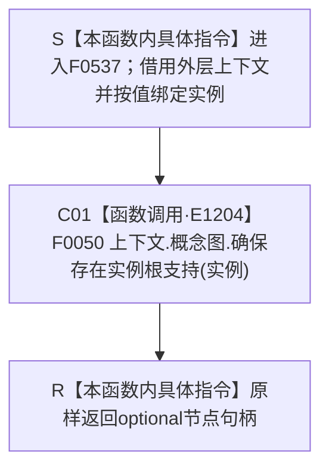

# CF-L4-0143 `语素与世界树快照读回自检存在实例根支持 lambda` 现状流程图

图类型：现状流程图
代码版本：`f7bc742f8126fcf66288fc940300de3331a0eebb`
源码 blob：`95681cdeef7ab705cf391738b05b36ca4fafc608`
覆盖文件：`海中鱼巣/自检.入口初始化.ixx:342`
唯一根函数：F0537
完整签名：`std::optional<海中鱼巣::节点句柄> 海中鱼巣::运行语素与世界树快照读回自检(const 海中鱼巣::入口初始化自检运行配置&)::<lambda@自检.入口初始化.ixx:342>::operator()(海中鱼巣::节点句柄 实例) const`
参数：闭包按引用借用外层 `上下文`，不得逃逸外层作用域；`实例` 按值传入
返回结果：原样返回 F0050 形成的 `std::optional<节点句柄>`
已登记调用方：F0015 经 E1198
直接项目函数：F0050 经 E1204
外部边界：无
未解析项目调用：无
调用图：`流程图/主程序可达调用关系/01_main可达项目调用边表.md`
逐行映射表：`流程图/代码流程图/L4/CF-L4-0143_语素与世界树快照读回自检存在实例根支持lambda_逐行代码映射表.md`
输入契约 / 调用语境表：本文“调用合同与边界”
非成功返回二分审查表：本文“调用合同与边界”
偏差清单：无；项目调用已由 E1204 登记
依据提交 / 结构化消息：当前 HEAD `f7bc742f8126fcf66288fc940300de3331a0eebb`、正式身份表、边表与制图队列
验证输出：第 342 行完整映射；1 个项目入边、1 个项目出边、0 个外部边界、0 个未解析调用
依据：`规范/0050_项目通用机器逻辑与禁止性规则总纲_20260721.md`、`规范/0600_代码函数流程图应用与维护规范.md`
不得作为施工许可：是
不得宣称：本自检 lambda 证明存在实例根支持必然形成、语素与世界树快照已经通过或生产能力已经完成

## 流程图

## 调用合同与边界

| 调用边 | 节点 | 实参与结果 | 非成功口径 | 结构变化 |
| --- | --- | --- | --- | --- |
| E1204 | C01 | `实例` → optional 节点句柄 | 空 optional 由 F0050 决定并原样传播 | 由 F0050 决定；本 lambda 不追加写入 |

本函数只同步转接外层自检环境中的存在实例根支持调用，不读取后续自我初始化快照，也不自行判定专项自检是否通过。
