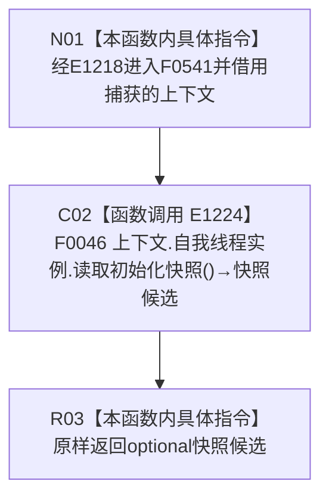

# CF-L4-0147 根需求稳定语义与特征定义自检快照 lambda 现状流程图

图类型：现状流程图
代码版本：`14d539ed7ad8af87f35fb0752eed420bbe443316`
源码 blob：`95681cdeef7ab705cf391738b05b36ca4fafc608`
覆盖文件：`海中鱼巣/自检.入口初始化.ixx:372`
唯一根函数：F0541
完整签名：`std::optional<海中鱼巣::自我线程初始化快照> 海中鱼巣::运行根需求稳定语义与特征定义自检(const 海中鱼巣::入口初始化自检运行配置&)::<lambda@自检.入口初始化.ixx:372>::operator()() const`
参数：无显式参数；lambda 通过 `[&]` 非拥有引用捕获外层 `上下文`
返回结果：原样返回 F0046 的 `std::optional<自我线程初始化快照>`
已登记调用方：F0015 经 E1218 回调调用
直接项目函数：E1224 调用 F0046
外部边界：无
未解析项目调用：0
调用图：`流程图/主程序可达调用关系/01_main可达项目调用边表.md`
逐行映射表：`流程图/代码流程图/L4/CF-L4-0147_根需求稳定语义与特征定义自检快照lambda_逐行代码映射表.md`
偏差清单：无；本文只冻结当前代码事实
依据提交 / 结构化消息：当前提交、F0541、E1218、E1224 与源码第 372 行交叉复核
结构读取与写入：由 F0046 承载；本 lambda 只同步转发
逻辑内返回：空 optional 由 F0046 形成并原样透传
内部错误：本 lambda 无新增内部错误分支
生命周期与资源释放：无显式参数；上下文只在同步调用期间借用；快照按值返回
异常：未捕获；F0046 的异常向调用方传播
并发 / 幂等：快照一致性与读取同步由 F0046 承担
验证输出：1 行定义完整映射；1 个项目入边、1 个项目出边、0 个外部边界、0 个未解析调用
不得作为施工许可：是
不得宣称：返回快照证明根需求稳定语义、特征定义、线程状态或生产接线持续有效

## 函数合同

```text
根函数：F0541 根需求稳定语义与特征定义自检快照 lambda
归属模块 / 文件 / 层级：自检.入口初始化 / 海中鱼巣/自检.入口初始化.ixx / L4
现有或待新增：现有局部 lambda
参数：无显式参数；上下文按引用捕获
返回结果：原样转发 F0046 的 optional 初始化快照
被调函数流程图：流程图/代码流程图/L4/CF-L4-0010_自我线程_读取初始化快照_现状流程图.md
```

## 流程图



## 节点合同

| 节点 | 类型 | 输入绑定 | 输出绑定 | 事实读写 | 后继 |
| --- | --- | --- | --- | --- | --- |
| N01 | 本函数内具体指令 | E1218 无实参回调；引用捕获上下文 | 进入同步转发 | 无 | C02 |
| C02 | 函数调用 | 自我线程实例；无显式实参 | F0046 optional 快照 | 由 F0046 承载 | R03 |
| R03 | 本函数内具体指令 | 快照候选 | 原样返回 | 无新增写入 | 结束 |

## 当前边界

- 返回的是 F0046 形成的值式 optional 快照；本 lambda 不保存线程内部引用。
- 空 / 有值 optional 的语义由 F0046 裁决，本 lambda 不增加分支，也不执行根需求稳定语义与特征定义验收。
