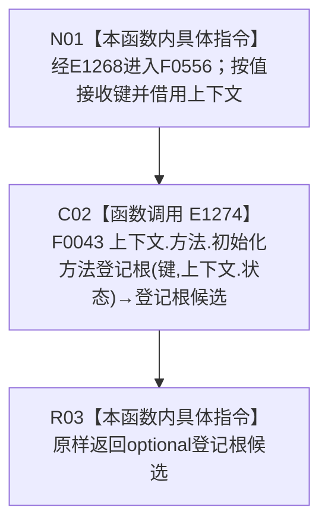

# CF-L4-0156 自我线程重复启动结构不变自检方法登记根 lambda 现状流程图

图类型：现状流程图
代码版本：`0a93526882cb33c61c2fbb04ecad1aeaddcfe225`
源码 blob：`59de05d5ba3594942c819c9ec50e3d0ebc6cb9bd`
覆盖文件：`海中鱼巣/自检.入口初始化.ixx:434`
唯一根函数：F0556
完整签名：`std::optional<海中鱼巣::方法登记根材料> 海中鱼巣::运行自我线程重复启动结构不变自检(const 海中鱼巣::入口初始化自检运行配置&)::<lambda@自检.入口初始化.ixx:434>::operator()(std::uint64_t 键) const`
参数：`键` 按值传入；lambda 通过 `[&]` 非拥有引用捕获外层 `上下文`
返回结果：原样返回 F0043 的 `std::optional<方法登记根材料>`
已登记调用方：F0015 经 E1268 回调调用
直接项目函数：E1274→F0043
外部边界：无
未解析项目调用：0
调用图：`流程图/主程序可达调用关系/01_main可达项目调用边表.md`
逐行映射表：`流程图/代码流程图/L4/CF-L4-0156_自我线程重复启动结构不变自检方法登记根lambda_逐行代码映射表.md`
偏差清单：无；本文只冻结当前代码事实
依据提交 / 结构化消息：当前提交、F0556、E1268、E1274 与源码第 434 行交叉复核
结构读取与写入：由 F0043 承载；本 lambda 只同步转发
逻辑内返回：空 optional 由 F0043 形成并原样透传
内部错误：本 lambda 无新增内部错误分支
生命周期与资源释放：键按值；上下文只在同步调用期间借用
异常：未捕获；F0043 异常向调用方传播
并发 / 幂等：由 F0043 及其输入状态承担
验证输出：1 行定义完整映射；1 个项目入边、1 个项目出边、0 个外部边界、0 个未解析调用
不得作为施工许可：是
不得宣称：optional 有值证明线程重复启动结构不变、自我循环或系统初始化已经完成

## 函数合同

```text
根函数：F0556 自我线程重复启动结构不变自检方法登记根 lambda
归属模块 / 文件 / 层级：自检.入口初始化 / 海中鱼巣/自检.入口初始化.ixx / L4
现有或待新增：现有局部 lambda
参数：键按值；上下文按引用捕获
返回结果：原样转发 F0043 的 optional 方法登记根材料
被调函数流程图：流程图/代码流程图/L4/CF-L4-0007_方法服务_初始化方法登记根_现状流程图.md
```

## 流程图



## 节点合同

| 节点 | 类型 | 输入绑定 | 输出绑定 | 事实读写 | 后继 |
| --- | --- | --- | --- | --- | --- |
| N01 | 本函数内具体指令 | E1268 传入键；引用捕获上下文 | 进入同步转发 | 无 | C02 |
| C02 | 函数调用 | `上下文.方法`、键、`上下文.状态` | F0043 optional 结果 | 由 F0043 承载 | R03 |
| R03 | 本函数内具体指令 | 登记根候选 | 原样返回 | 无新增写入 | 结束 |

## 当前边界

- 空 / 有值 optional 均由 F0043 形成；本 lambda 不增加分支、错误映射或发布行为。
- 本 lambda 只是 ENTRY-ONLY-S13 自检端口的一项绑定，不展开重复启动结构不变验收。
