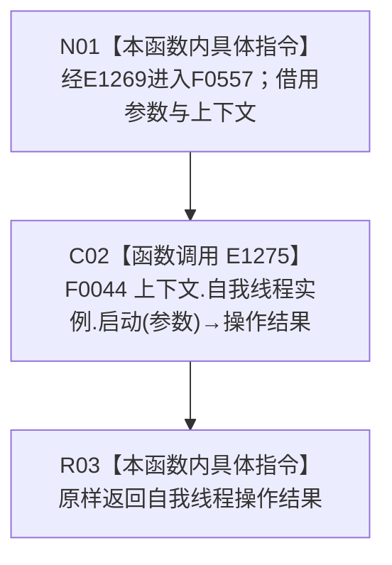

# CF-L4-0157 自我线程重复启动结构不变自检启动 lambda 现状流程图

图类型：现状流程图
代码版本：`0a93526882cb33c61c2fbb04ecad1aeaddcfe225`
源码 blob：`59de05d5ba3594942c819c9ec50e3d0ebc6cb9bd`
覆盖文件：`海中鱼巣/自检.入口初始化.ixx:435`
唯一根函数：F0557
完整签名：`海中鱼巣::自我线程操作结果 海中鱼巣::运行自我线程重复启动结构不变自检(const 海中鱼巣::入口初始化自检运行配置&)::<lambda@自检.入口初始化.ixx:435>::operator()(const 海中鱼巣::自我根需求初始化参数& 参数) const`
参数：`参数` 为调用期间有效的 const 非拥有借用；lambda 通过 `[&]` 非拥有引用捕获外层 `上下文`
返回结果：原样返回 F0044 的 `自我线程操作结果`
已登记调用方：F0015 经 E1269 回调调用
直接项目函数：E1275→F0044
外部边界：无
未解析项目调用：0
调用图：`流程图/主程序可达调用关系/01_main可达项目调用边表.md`
逐行映射表：`流程图/代码流程图/L4/CF-L4-0157_自我线程重复启动结构不变自检启动lambda_逐行代码映射表.md`
偏差清单：无；本文只冻结当前代码事实
依据提交 / 结构化消息：当前提交、F0557、E1269、E1275 与源码第 435 行交叉复核
结构读取与写入：由 F0044 承载；本 lambda 只同步转发
逻辑内返回：由 F0044 形成的拒绝或已有状态结果原样透传
内部错误：本 lambda 无新增内部错误分支
生命周期与资源释放：参数和上下文只在同步调用期间借用
异常：未捕获；F0044 异常向调用方传播
并发 / 幂等：由 F0044 的线程生命周期合同承担
验证输出：1 行定义完整映射；1 个项目入边、1 个项目出边、0 个外部边界、0 个未解析调用
不得作为施工许可：是
不得宣称：操作结果成功证明重复启动不变、自我线程生命周期、系统初始化或业务闭环已经完成

## 函数合同

```text
根函数：F0557 自我线程重复启动结构不变自检启动 lambda
归属模块 / 文件 / 层级：自检.入口初始化 / 海中鱼巣/自检.入口初始化.ixx / L4
现有或待新增：现有局部 lambda
参数：自我根需求初始化参数 const 借用；上下文按引用捕获
返回结果：原样转发 F0044 的自我线程操作结果
被调函数流程图：流程图/代码流程图/L4/CF-L4-0008_自我线程_启动_现状流程图.md
```

## 流程图



## 节点合同

| 节点 | 类型 | 输入绑定 | 输出绑定 | 事实读写 | 后继 |
| --- | --- | --- | --- | --- | --- |
| N01 | 本函数内具体指令 | E1269 传入参数；引用捕获上下文 | 进入同步转发 | 无 | C02 |
| C02 | 函数调用 | `上下文.自我线程实例`、参数 | F0044 操作结果 | 由 F0044 承载 | R03 |
| R03 | 本函数内具体指令 | 操作结果 | 原样返回 | 无新增写入 | 结束 |

## 当前边界

- 本 lambda 不解释或改写 F0044 的结果，只把操作结果同步传回 F0015。
- 本 lambda 只是 ENTRY-ONLY-S13 自检端口的一项绑定，不承担重复启动断言或结构快照比较。
