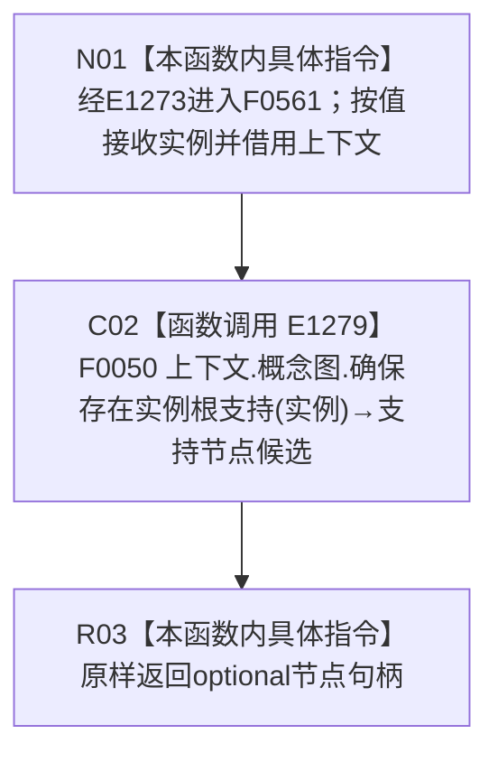

# CF-L4-0161 自我线程重复启动结构不变自检存在实例根支持 lambda 现状流程图

图类型：现状流程图
代码版本：`14d539ed7ad8af87f35fb0752eed420bbe443316`
源码 blob：`95681cdeef7ab705cf391738b05b36ca4fafc608`
覆盖文件：`海中鱼巣/自检.入口初始化.ixx:438`
唯一根函数：F0561
完整签名：`std::optional<海中鱼巣::节点句柄> 海中鱼巣::运行自我线程重复启动结构不变自检(const 海中鱼巣::入口初始化自检运行配置&)::<lambda@自检.入口初始化.ixx:438>::operator()(海中鱼巣::节点句柄 实例) const`
参数：`实例` 按值传入；lambda 通过 `[&]` 非拥有引用捕获外层 `上下文`
返回结果：原样返回 F0050 的 `std::optional<节点句柄>`
已登记调用方：F0015 经 E1273 回调调用
直接项目函数：E1279→F0050
外部边界：无
未解析项目调用：0
调用图：`流程图/主程序可达调用关系/01_main可达项目调用边表.md`
逐行映射表：`流程图/代码流程图/L4/CF-L4-0161_自我线程重复启动结构不变自检存在实例根支持lambda_逐行代码映射表.md`
偏差清单：无；本文只冻结当前代码事实
依据提交 / 结构化消息：当前提交、F0561、E1273、E1279 与源码第 438 行交叉复核
结构读取与写入：由 F0050 承载；本 lambda 只同步转发
逻辑内返回：空 optional 由 F0050 形成并原样透传
内部错误：本 lambda 无新增内部错误分支
生命周期与资源释放：实例句柄按值；上下文只在同步调用期间借用
异常：未捕获；F0050 异常向调用方传播
并发 / 幂等：由 F0050 的概念图结构合同承担
验证输出：1 行定义完整映射；1 个项目入边、1 个项目出边、0 个外部边界、0 个未解析调用
不得作为施工许可：是
不得宣称：optional 有值证明实例支持关系、重复启动结构不变或完整概念图已经完成验收

## 函数合同

```text
根函数：F0561 自我线程重复启动结构不变自检存在实例根支持 lambda
归属模块 / 文件 / 层级：自检.入口初始化 / 海中鱼巣/自检.入口初始化.ixx / L4
现有或待新增：现有局部 lambda
参数：实例句柄按值；上下文按引用捕获
返回结果：原样转发 F0050 的 optional 节点句柄
被调函数流程图：流程图/代码流程图/L4/CF-L4-0014_概念图服务_确保存在实例根支持_现状流程图.md
```

## 流程图



## 节点合同

| 节点 | 类型 | 输入绑定 | 输出绑定 | 事实读写 | 后继 |
| --- | --- | --- | --- | --- | --- |
| N01 | 本函数内具体指令 | E1273 传入实例句柄；引用捕获上下文 | 进入同步转发 | 无 | C02 |
| C02 | 函数调用 | `上下文.概念图`、实例句柄 | F0050 optional 节点句柄 | 由 F0050 承载 | R03 |
| R03 | 本函数内具体指令 | 支持节点候选 | 原样返回 | 无新增写入 | 结束 |

## 当前边界

- 本 lambda 不解释空 optional，也不展开 F0050 的结构读取、创建或关系发布分支。
- 本 lambda 只是 ENTRY-ONLY-S13 自检端口的一项绑定，不承担重复启动断言或结构数量比较。
