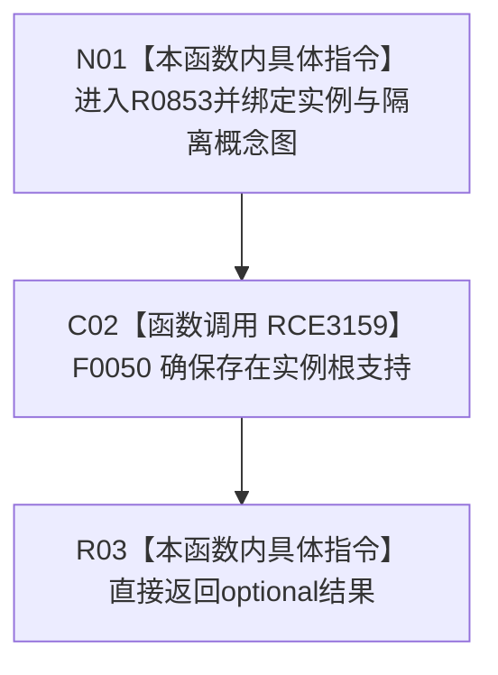

# CF-L4-0167 确保存在实例根支持回调现状流程图

图类型：现状流程图
代码版本：`03a8b7ac099ccea83e57f2696e2290b7bcdfacaf`
当前工作区复核基线：`4e0ac10ae3b18404ff2b623faa0fb006fa0fc7a1`
源码 blob：`59de05d5ba3594942c819c9ec50e3d0ebc6cb9bd`
覆盖文件：`海中鱼巣/自检.入口初始化.ixx:501`
唯一根函数：R0853
完整签名：`std::optional<海中鱼巣::节点句柄> 海中鱼巣::运行自我场景多存在特征状态自检(const 海中鱼巣::入口初始化自检运行配置&)::<lambda@自检.入口初始化.ixx:501>::operator()(海中鱼巣::节点句柄 实例) const`
参数：实例节点句柄按值；闭包同步借用隔离概念图服务
返回结果：直接返回存在实例根支持 optional
调用图：正式 main 可达关系表
已登记调用方：F0015（RCE3153）
直接项目函数：F0050（RCE3159）
外部边界：无
逐行映射表：`流程图/代码流程图/L4/CF-L4-0167_确保存在实例根支持回调_逐行代码映射表.md`
不得作为施工许可：是
不得宣称：含值结果证明实例全部概念关系已经独立验收

## 流程图

## 当前边界

- 支持关系的创建、幂等与空结果语义由 F0050 承担。
