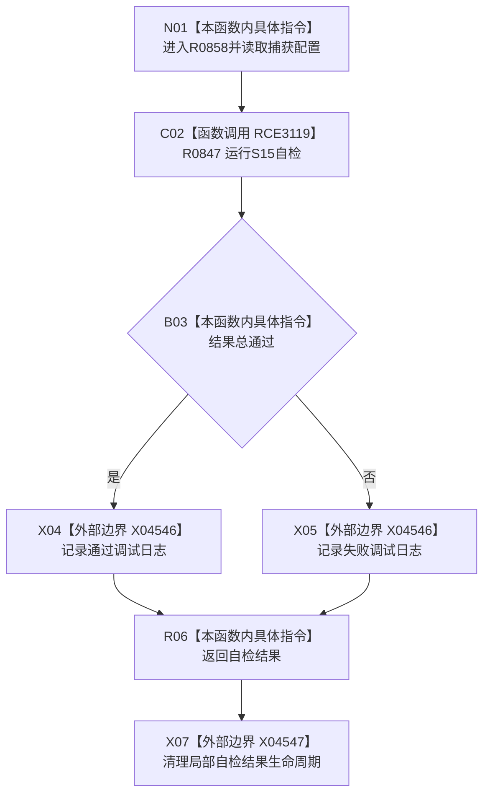

# CF-L4-0168 入口初始化 S15 自检回调现状流程图

图类型：现状流程图
代码版本：`03a8b7ac099ccea83e57f2696e2290b7bcdfacaf`
当前工作区复核基线：`4e0ac10ae3b18404ff2b623faa0fb006fa0fc7a1`
源码 blob：`59de05d5ba3594942c819c9ec50e3d0ebc6cb9bd`
覆盖文件：`海中鱼巣/自检.入口初始化.ixx:687`
唯一根函数：R0858
完整签名：`海中鱼巣::自检单元结果 海中鱼巣::登记入口初始化自检单元(海中鱼巣::自检运行器&, const 海中鱼巣::入口初始化自检运行配置&)::<lambda@自检.入口初始化.ixx:687>::operator()() const`
参数：无显式参数；闭包按值捕获入口初始化自检配置
返回结果：返回 S15 自检单元结果
调用图：正式 main 可达关系表
已登记调用方：F0029、F0031
直接项目函数：R0847（RCE3119）
外部边界：X04546、X04547
逐行映射表：`流程图/代码流程图/L4/CF-L4-0168_入口初始化S15自检回调_逐行代码映射表.md`
不得作为施工许可：是
不得宣称：日志文字或回调返回证明整个入口初始化能力完成

## 流程图

## 当前边界

- 调试日志为人读诊断；自检结果值由 R0847 形成。
