# CF-L4-0169 运行节点直接身份结构写入自检现状流程图

图类型：现状流程图
代码版本：`3242c16640da898b546f294199c00c08032ba49c`
源码 blob：`74c9a0b00dc1d14b4919e335873068fb02e51336`
覆盖文件：`海中鱼巣/核心/自检.节点直接身份结构写入.ixx:1486-1666`
唯一根函数：R0897
完整签名：`节点直接身份结构写入自检报告 海中鱼巣::运行节点直接身份结构写入自检()`
参数：无
返回结果：`节点直接身份结构写入自检报告`；包含固定 77 项布尔验收、失败数量和总通过值
调用图：正式 main 可达关系表；共享稳定边由顶层维护者收口
逐行映射表：`流程图/代码流程图/L4/CF-L4-0169_运行节点直接身份结构写入自检_逐行代码映射表.md`
输入契约 / 调用语境表：无独立文件；R0895 调用本函数，自检辅助函数自行构造隔离材料
非成功返回二分审查表：无中途返回；辅助结果的 false 被保留为验收失败项，不包装为业务成功
偏差清单：本函数只汇总多个自检证据；输出文本和总通过值均不得充当生产机器事实
依据提交 / 结构化消息：`3242c166`；父任务 R0897 指派
验证输出：本批仅执行 Markdown、Mermaid 与逐行覆盖机械验证，不运行构建或程序
不得作为施工许可：是
不得宣称：77 项全部通过代表节点直接结构事务已完成生产接线、持久恢复或端到端业务闭环

## 流程图

```mermaid
flowchart TD
    N01["N01【本函数内具体指令】进入R0897并引入自检内部命名空间"] --> N02["N02【本函数内具体指令】值初始化77项报告"]
    N02 --> C03["C03【函数调用】验证稳定主键与幂等冲突() -> 布尔值"]
    C03 --> C04["C04【函数调用】运行主路径() -> 主路径证据"]
    C04 --> C05["C05【函数调用】验证逆序撤销() -> 布尔值"]
    C05 --> C06["C06【函数调用】验证撤销失败隔离() -> 布尔值"]
    C06 --> C07["C07【函数调用】验证视图与值式边界() -> 布尔值"]
    C07 --> C08["C08【函数调用】验证新域隔离() -> 布尔值"]
    C08 --> C09["C09【函数调用】验证仅参与者事务() -> 12项证据"]
    C09 --> C10["C10【函数调用】验证世界树P1A1记录仓() -> 15项证据"]
    C10 --> C11["C11【函数调用】验证P1A2节点关系事务() -> 32项证据"]
    C11 --> C12["C12【函数调用】验证六仓批量恢复事务() -> 布尔值"]
    C12 --> C13["C13【函数调用】验证格式二材料经数据操作恢复() -> 2项证据"]
    C13 --> N14["N14【本函数内具体指令】写入P1-A01至P1-A15验收位"]
    N14 --> N15["N15【本函数内具体指令】写入CORE-A01至CORE-A12验收位"]
    N15 --> N16["N16【本函数内具体指令】写入WORLD-P1A1-A01至A15验收位"]
    N16 --> N17["N17【本函数内具体指令】写入WORLD-P1A2-A01至A32验收位"]
    N17 --> N18["N18【本函数内具体指令】写入六仓恢复和格式二恢复3项验收位"]
    N18 --> X19["X19【外部边界】报告.验收.begin() -> 首迭代器"]
    N18 --> X20["X20【外部边界】报告.验收.end() -> 尾迭代器"]
    X19 --> X21["X21【外部边界】std::count(首,尾,false) -> 失败项数"]
    X20 --> X21
    X21 --> N22["N22【本函数内具体指令】把失败项数转换并写入报告.失败数量"]
    N22 --> N23["N23【本函数内具体指令】设置报告.总通过 = 失败数量等于0"]
    N23 --> N24["N24【本函数内具体指令】按验收槽顺序初始化77个固定人读名称"]
    N24 --> N25["N25【本函数内具体指令】初始化输出循环序号为0"]
    N25 --> X26["X26【外部边界】报告.验收.size() -> 验收项数"]
    X26 --> N27{"N27【本函数内具体指令】序号是否小于验收项数"}
    N27 -- 是 --> X28["X28【外部边界】std::cout插入名称组[序号]"]
    X28 --> X29["X29【外部边界】std::cout插入分隔文本"]
    X29 --> X30["X30【外部边界】std::cout插入通过或失败文本"]
    X30 --> X31["X31【外部边界】std::cout插入换行"]
    X31 --> N32["N32【本函数内具体指令】序号自增"]
    N32 --> X26
    N27 -- 否 --> R33["R33【本函数内具体指令】返回报告"]
```

## 被调函数与稳定签名

| 节点 | 冻结候选稳定签名 | 结果绑定 |
| --- | --- | --- |
| C03 | `bool 海中鱼巣::节点直接身份结构写入自检内部::验证稳定主键与幂等冲突()` | `稳定主键与幂等冲突通过` |
| C04 | `主路径证据 海中鱼巣::节点直接身份结构写入自检内部::运行主路径()` | `主路径` |
| C05 | `bool 海中鱼巣::节点直接身份结构写入自检内部::验证逆序撤销()` | `逆序撤销通过` |
| C06 | `bool 海中鱼巣::节点直接身份结构写入自检内部::验证撤销失败隔离()` | `撤销失败隔离通过` |
| C07 | `bool 海中鱼巣::节点直接身份结构写入自检内部::验证视图与值式边界()` | `视图与值式边界通过` |
| C08 | `bool 海中鱼巣::节点直接身份结构写入自检内部::验证新域隔离()` | `新域隔离通过` |
| C09 | `仅参与者事务证据 海中鱼巣::节点直接身份结构写入自检内部::验证仅参与者事务()` | `仅参与者事务` |
| C10 | `世界树P1A1证据 海中鱼巣::节点直接身份结构写入自检内部::验证世界树P1A1记录仓()` | `世界树P1A1` |
| C11 | `P1A2节点关系事务证据 海中鱼巣::节点直接身份结构写入自检内部::验证P1A2节点关系事务()` | `世界树P1A2` |
| C12 | `bool 海中鱼巣::节点直接身份结构写入自检内部::验证六仓批量恢复事务()` | `六仓恢复事务` |
| C13 | `std::array<bool, 2> 海中鱼巣::节点直接身份结构写入自检内部::验证格式二材料经数据操作恢复()` | `格式二恢复` |

## 当前边界

- R0897 只在局部报告中汇总验收结果；它不提交生产事务、不发布节点关系，也不改变仓库权威状态。
- C03-C13 的 false 或失败证据不会触发中途返回，而是在 N14-N18 固定槽位中形成失败项。
- X28-X31 只输出人读自检诊断；文本、输出成功与否均不参与 `报告.总通过` 的机器裁决。
- 本函数没有 catch；辅助函数、标准库或流调用抛出的异常不会被转换为普通失败报告。
