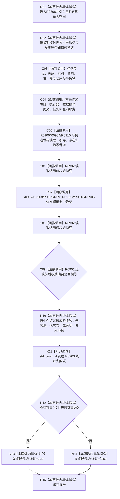

# CF-L4-0170 运行节点直接世界结构骨架自检现状流程图

图类型：现状流程图
代码版本：`3242c16640da898b546f294199c00c08032ba49c`
源码 blob：`ef195168d944674fc4564530cef091c546c637fd`
覆盖文件：`海中鱼巣/领域/自检.节点直接世界结构骨架.ixx:147-229`
唯一根函数：R0898
完整签名：`海中鱼巣::节点直接世界结构骨架自检报告 海中鱼巣::运行节点直接世界结构骨架自检()`
参数：无
返回结果：七项安全未实现骨架验收及失败数量；不返回业务完成事实
调用图：正式 main 可达关系表；共享稳定边由顶层维护者收口
逐行映射表：`流程图/代码流程图/L4/CF-L4-0170_运行节点直接世界结构骨架自检_逐行代码映射表.md`
输入契约 / 调用语境表：无独立文件；仅自检入口调用，使用函数内隔离仓库和隔离持久端口
非成功返回二分审查表：无中途返回；七个 `未实现` 是本骨架自检的预期结果
偏差清单：七个服务入口均为安全未实现骨架，不得升级为已实现能力
依据提交 / 结构化消息：`3242c166`；父任务 R0898 指派
验证输出：本批仅文档机械验证，不运行程序或构建
不得作为施工许可：是
不得宣称：自检总通过代表世界引导、世界读取、存在或场景写入已实现

## 流程图

## 当前边界

- 所有仓库、事务域和端口均在函数内隔离构造；验收前后通过 R0902 比较权威摘要。
- 七个入口的预期结果是 `未实现`、零代次或空载荷；这是安全骨架证明，不是能力完成证明。
- R0914 配对图只消费 3242c166 的 clean blob；当前工作区 dirty 不进入本批代码事实。
