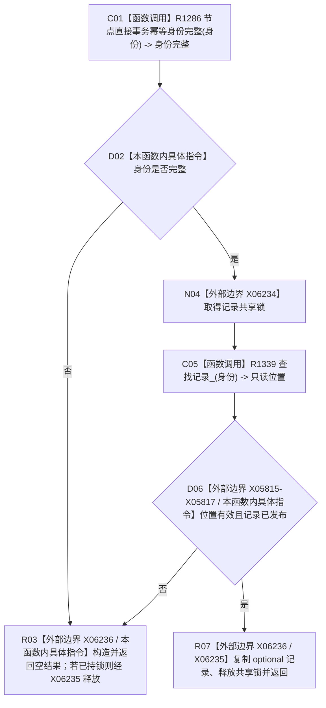

# CF-L4-0171 节点直接事务幂等记录读取现状流程图

图类型：现状流程图
代码版本：`4b80f1617dd70ec7a19e1a34efa9da768dce8927`
源码 blob：`51f626fd79eb63dba5b57bf329ef3aae0a59abbc`
覆盖文件：`海中鱼巣/核心/仓库.节点直接事务幂等.ixx:83-90`
唯一根函数：R1315
完整签名：`std::optional<节点直接事务幂等记录> 海中鱼巣::节点直接事务幂等仓库::读取(节点直接事务幂等身份 身份) const`
参数：身份按值；函数只读借用当前仓库
返回结果：身份完整且存在已发布记录时返回记录副本，否则返回 `std::nullopt`
调用图：F0027 -> R1315；R1315 -> R1286（身份完整）、R1339（只读查找记录）
逐行映射表：`流程图/代码流程图/L4/CF-L4-0171_读取_逐行代码映射表.md`
输入契约 / 调用语境表：F0027 生产运行期自检读取幂等记录
非成功返回二分审查表：身份不完整、记录不存在或未发布均为只读空结果，不改变结构
偏差清单：RCE4291/RCE4292 调用点应分别精确到第 84/86 行
依据提交 / 结构化消息：`4b80f161`
验证输出：本批仅文档机械验证
不得作为施工许可：是
不得宣称：读取到记录代表持久证据已验证或业务事务已验收

## 流程图

## 当前边界

- 本函数在共享锁下读取记录组，不改变记录、发布状态或侧账。
