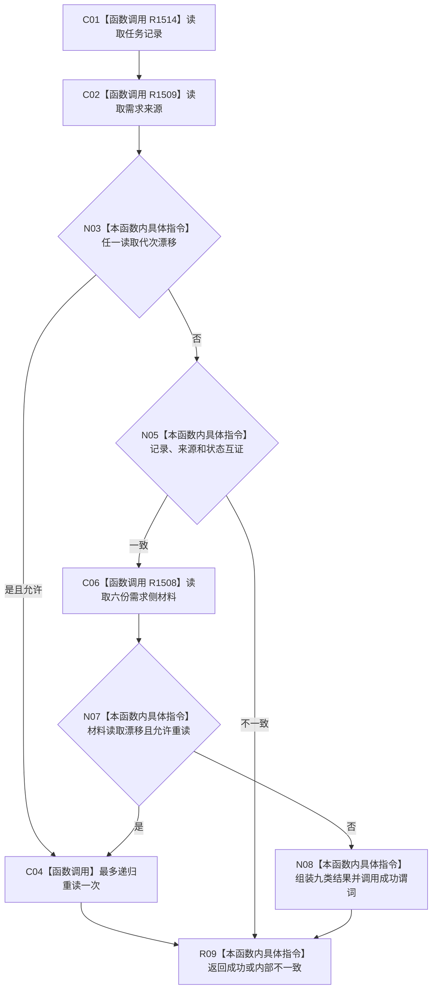

# CF-L4-0172 最终读回现状流程图

图类型：现状流程图
代码版本：`d534058e154177d4576f50a92ec448dc3f38a507`；源码 blob：`d03f149888dca1ad51c2c841a28930f29aeb083d`
覆盖文件：`海中鱼巣/领域/服务.需求任务子目标承接.ixx:228-280`
唯一根函数：R1507
完整签名：`需求任务子目标承接结果 海中鱼巣::需求任务子目标承接内部::最终读回(L2需求结构服务& 需求服务, L2任务子目标承接记录结构服务& 记录服务, L2任务子目标承接记录身份 记录身份, 需求任务子目标承接来源 来源分类, 需求任务子目标承接状态 成功状态, std::uint64_t 截止, bool 允许重读 = true)`
参数：两个借用服务、记录身份、来源分类、成功状态、截止和一次重读开关。
返回结果：完整双向读回结果或具名非成功。
调用图：`流程图/主程序可达调用关系/05_需求任务子目标承接当前调用子图.md`；逐行映射表：同目录 `CF-L4-0172_最终读回_逐行代码映射表.md`
输入契约 / 调用语境表：调用子图“输入契约与非成功二分”
非成功返回二分审查表：调用子图“输入契约与非成功二分”
偏差清单：调用子图“NOT_RUN 与待展开”
依据提交 / 结构化消息：`5aada0f2` / `d534058e`
验证输出：静态源码复核；运行验证未执行
不得作为施工许可：是
不得宣称：并发漂移动态分支已运行或双 owner 写入原子

