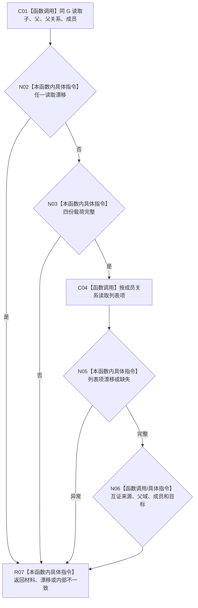

# CF-L4-0173 读取需求侧材料组现状流程图

图类型：现状流程图
代码版本：`d534058e154177d4576f50a92ec448dc3f38a507`；源码 blob：`d03f149888dca1ad51c2c841a28930f29aeb083d`
覆盖文件：`海中鱼巣/领域/服务.需求任务子目标承接.ixx:150-199`
唯一根函数：R1508
完整签名：`需求侧材料读取结果 海中鱼巣::需求任务子目标承接内部::读取需求侧材料组(L2需求结构服务& 服务, const L2任务子目标承接记录事实& 记录, const L2需求任务子目标来源关系事实& 来源, std::uint64_t 截止)`
参数：需求服务借用、记录事实、来源事实与统一截止。
返回结果：完整需求侧材料、漂移回显或内部不一致空材料。
调用图：`流程图/主程序可达调用关系/05_需求任务子目标承接当前调用子图.md`；逐行映射表：同目录 `CF-L4-0173_读取需求侧材料组_逐行代码映射表.md`
输入契约 / 调用语境表：调用子图“输入契约与非成功二分”
非成功返回二分审查表：调用子图“输入契约与非成功二分”
偏差清单：调用子图“NOT_RUN 与待展开”
依据提交 / 结构化消息：`5aada0f2` / `d534058e`；验证输出：静态复核，运行未执行
不得作为施工许可：是；不得宣称：材料存在即业务完成

