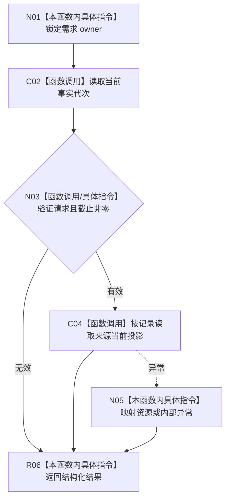

# CF-L4-0174 按任务子目标记录读取需求来源现状流程图

图类型：现状流程图
代码版本：`d534058e154177d4576f50a92ec448dc3f38a507`；源码 blob：`732e1ef76190a5538a0ac2f6c27d3fb95fe90d03`
覆盖文件：`海中鱼巣/领域/服务.L2需求结构.ixx:3742-3763`
唯一根函数：R1509
完整签名：`L2按任务子目标记录读取需求来源结果 海中鱼巣::L2需求结构服务::按任务子目标记录读取需求来源(L2按任务子目标记录读取需求来源请求 请求) const noexcept`
参数：按值请求；隐式 `this` 借用需求 owner 服务。
返回结果：结构化来源关系组读取结果。
调用图：`流程图/主程序可达调用关系/05_需求任务子目标承接当前调用子图.md`；逐行映射表：`流程图/代码流程图/L4/CF-L4-0174_按任务子目标记录读取需求来源_逐行代码映射表.md`
输入契约 / 调用语境表：调用子图“输入契约与非成功二分”
非成功返回二分审查表：调用子图“输入契约与非成功二分”
偏差清单：调用子图“NOT_RUN 与待展开”
依据提交 / 结构化消息：`5aada0f2` / `d534058e`；验证输出：静态复核，运行未执行
不得作为施工许可：是；不得宣称：唯一结果或来源合同天然成立

