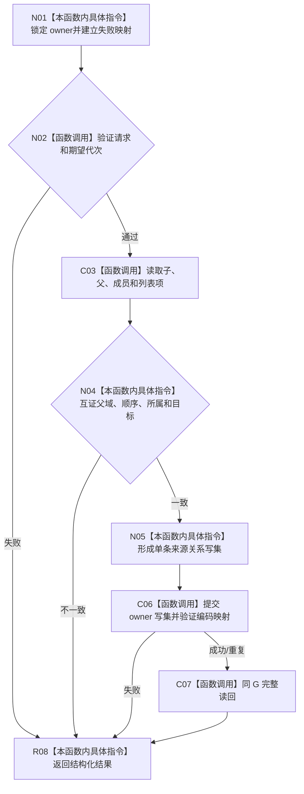

# CF-L4-0177 为既有需求建立任务子目标来源现状流程图

图类型：现状流程图
代码版本：`d534058e154177d4576f50a92ec448dc3f38a507`；源码 blob：`732e1ef76190a5538a0ac2f6c27d3fb95fe90d03`
覆盖文件：`海中鱼巣/领域/服务.L2需求结构.ixx:4226-4312`
唯一根函数：R1512
完整签名：`L2为既有需求建立任务子目标来源结果 海中鱼巣::L2需求结构服务::为既有需求建立任务子目标来源(L2为既有需求建立任务子目标来源请求 请求) noexcept`
参数：按值请求；隐式 `this`拥有需求 owner 写端口。
返回结果：既有需求、父、列表项、成员、父子和新增来源同代读回。
调用图：`流程图/主程序可达调用关系/05_需求任务子目标承接当前调用子图.md`；逐行映射表：`流程图/代码流程图/L4/CF-L4-0177_为既有需求建立任务子目标来源_逐行代码映射表.md`
输入契约 / 调用语境表：调用子图“输入契约与非成功二分”
非成功返回二分审查表：调用子图“输入契约与非成功二分”
偏差清单：调用子图“NOT_RUN 与待展开”
依据提交 / 结构化消息：`5aada0f2` / `d534058e`；验证输出：静态复核，运行未执行
不得作为施工许可：是；不得宣称：复用需求跨父或改变其目标

