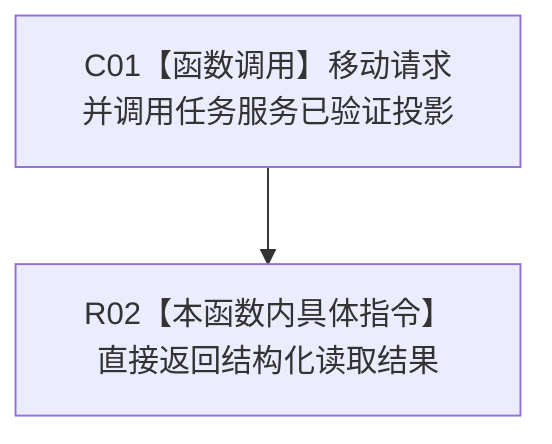

# CF-L4-0179 读取任务子目标承接记录现状流程图

图类型：现状流程图
代码版本：`d534058e154177d4576f50a92ec448dc3f38a507`；源码 blob：`6e13c91095c9bbfa4361358bc8bf26b0d9bb9a9e`
覆盖文件：`海中鱼巣/领域/服务.L2任务子目标承接记录结构.ixx:228-231`
唯一根函数：R1514
完整签名：`L2任务子目标承接记录读取结果 海中鱼巣::L2任务子目标承接记录结构服务::读取任务子目标承接记录(L2任务子目标承接记录读取请求 请求) const noexcept`
参数：按值读取请求；隐式 `this`借用任务记录 owner 服务。
返回结果：当前或历史记录结构化读取结果。
调用图：`流程图/主程序可达调用关系/05_需求任务子目标承接当前调用子图.md`；逐行映射表：`流程图/代码流程图/L4/CF-L4-0179_读取任务子目标承接记录_逐行代码映射表.md`
输入契约 / 调用语境表：调用子图“输入契约与非成功二分”
非成功返回二分审查表：调用子图“输入契约与非成功二分”
偏差清单：调用子图“NOT_RUN 与待展开”
依据提交 / 结构化消息：记录实现 `e8db8cc5`；当前复核 `d534058e`；验证输出：静态复核，运行未执行
不得作为施工许可：是；不得宣称：读取成功即记录业务已结算

