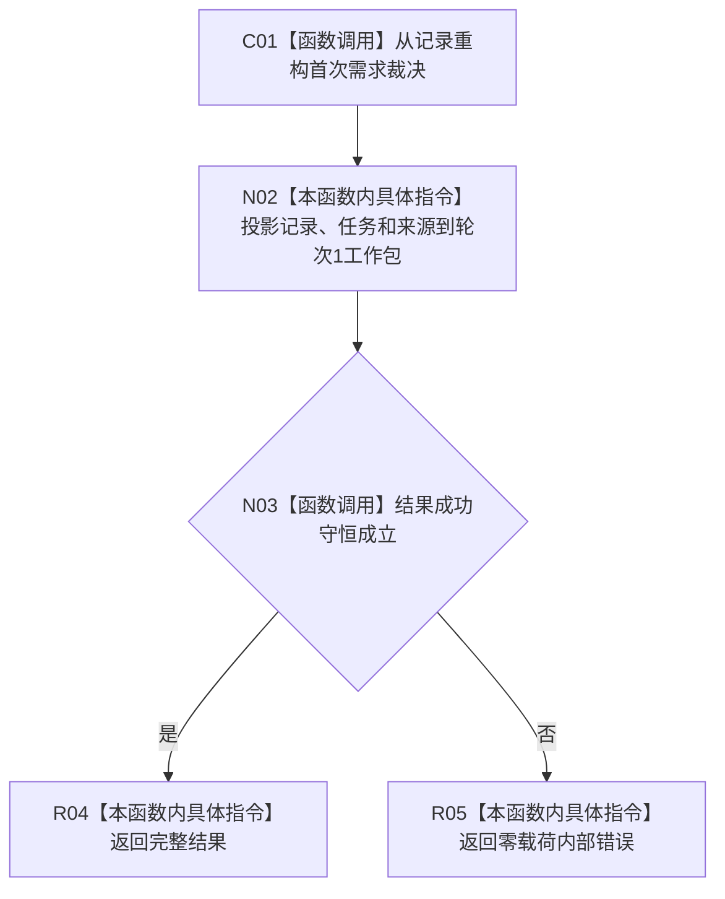

# CF-L4-0180 形成首次结果现状流程图

图类型：现状流程图
代码版本：`7d3e7c9e32623aaa9aa4b4c90b53ef634eb6f094`；源码 blob：`49d5c31745cdd82eccaf577626706ed22a393409`
覆盖文件：`海中鱼巣/领域/内部治理/服务.需求初次筹办准备.ixx:109-137`
唯一根函数：R1516
完整签名：`需求初次筹办准备结果 海中鱼巣::需求初次筹办准备内部::形成首次结果(需求初次筹办准备状态 状态, const L2任务初次筹办准备记录事实& 记录, const L2任务事实& 任务, const L2任务身份来源事实& 身份来源)`
参数：成功 / 重复状态与只读首次记录、任务、身份来源。
返回结果：完整首次工作包结果；守恒失败时降为零载荷内部错误。
调用图：`流程图/主程序可达调用关系/06_需求初次筹办工作包当前调用子图.md`；逐行映射表：同目录 `CF-L4-0180_形成首次结果_逐行代码映射表.md`
输入契约 / 调用语境表：调用子图“输入契约与非成功二分”
非成功返回二分审查表：调用子图“输入契约与非成功二分”
偏差清单：调用子图“当前实现边界与偏差”
依据提交 / 结构化消息：`17edb9d9` / `7d3e7c9e`
验证输出：静态源码复核；运行验证未执行
不得作为施工许可：是
不得宣称：工作包已被普通筹办入口消费

