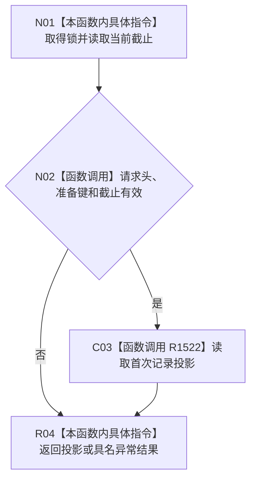

# CF-L4-0182 按初次筹办准备幂等身份读取首次记录现状流程图

图类型：现状流程图
代码版本：`7d3e7c9e32623aaa9aa4b4c90b53ef634eb6f094`；源码 blob：`d93c97b38a034e868d7d3c0796275d23bf48b652`
覆盖文件：`海中鱼巣/领域/服务.L2任务结构.ixx:4841-4867`
唯一根函数：R1518
完整签名：`L2按初次筹办准备幂等身份读取首次记录结果 海中鱼巣::L2任务结构服务::按初次筹办准备幂等身份读取首次记录(L2按初次筹办准备幂等身份读取首次记录请求 请求) const noexcept`
参数：请求头和非零准备幂等身份。
返回结果：当前观察截止下 0/1 份首次记录及首次任务 / 来源，或具名读取非成功。
调用图：`流程图/主程序可达调用关系/06_需求初次筹办工作包当前调用子图.md`；逐行映射表：同目录 `CF-L4-0182_按初次筹办准备幂等身份读取首次记录_逐行代码映射表.md`
输入契约 / 调用语境表：调用子图“输入契约与非成功二分”
非成功返回二分审查表：调用子图“输入契约与非成功二分”
偏差清单：调用子图“当前实现边界与偏差”
依据提交 / 结构化消息：`17edb9d9` / `7d3e7c9e`
验证输出：静态源码复核；运行验证未执行
不得作为施工许可：是
不得宣称：读取会修改任务或恢复已退出任务

