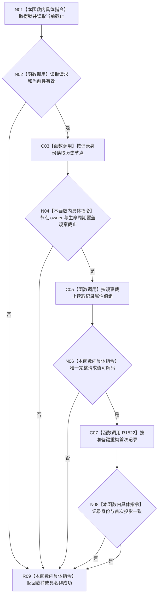

# CF-L4-0183 读取首次初次筹办准备记录现状流程图

图类型：现状流程图
代码版本：`7d3e7c9e32623aaa9aa4b4c90b53ef634eb6f094`；源码 blob：`d93c97b38a034e868d7d3c0796275d23bf48b652`
覆盖文件：`海中鱼巣/领域/服务.L2任务结构.ixx:4870-4942`
唯一根函数：R1519
完整签名：`L2任务初次筹办准备记录读取结果 海中鱼巣::L2任务结构服务::读取首次初次筹办准备记录(L2任务初次筹办准备记录读取请求 请求) const noexcept`
参数：请求头、记录身份、当前 / 历史类别与可选历史截止。
返回结果：按类别重构的首次记录、首次任务及身份来源，或具名读取非成功。
调用图：`流程图/主程序可达调用关系/06_需求初次筹办工作包当前调用子图.md`；逐行映射表：同目录 `CF-L4-0183_读取首次初次筹办准备记录_逐行代码映射表.md`
输入契约 / 调用语境表：调用子图“输入契约与非成功二分”
非成功返回二分审查表：调用子图“输入契约与非成功二分”
偏差清单：调用子图“当前实现边界与偏差”
依据提交 / 结构化消息：`17edb9d9` / `7d3e7c9e`
验证输出：静态源码复核；运行验证未执行
不得作为施工许可：是
不得宣称：历史读取使用当前任务或当前列表项补造材料

