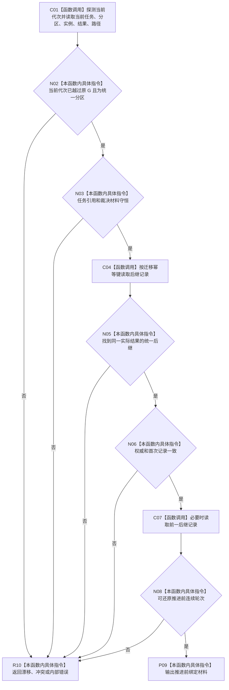

# CF-L4-0186 读取并互证已推进统一任务绑定现状流程图

图类型：现状流程图
代码版本：`dd8a7810693b7892b3265333f762b7c1c3bcd4d8`；源码 blob：`597af149798c2925b38406f95432c074dba28034`
覆盖文件：`海中鱼巣/领域/内部治理/服务.任务目标未达成重筹办触发.ixx:309-411`
唯一根函数：R1526
完整签名：`任务重筹办触发状态 海中鱼巣::任务重筹办触发内部::读取并互证已推进统一任务绑定(L2任务结构服务& 任务服务, const 任务重筹办意图& 意图, 当前任务绑定材料& 材料) noexcept`
参数：因原 G 漂移而需要恢复的同一重筹办意图。
返回结果：还原推进前绑定材料，或当前性漂移 / 冲突 / 内部状态。
调用图：`流程图/主程序可达调用关系/07_任务统一筹办轮次权威当前调用子图.md`；逐行映射表：同目录配对文件。
验证输出：静态源码复核；运行验证未执行
不得作为施工许可：是

