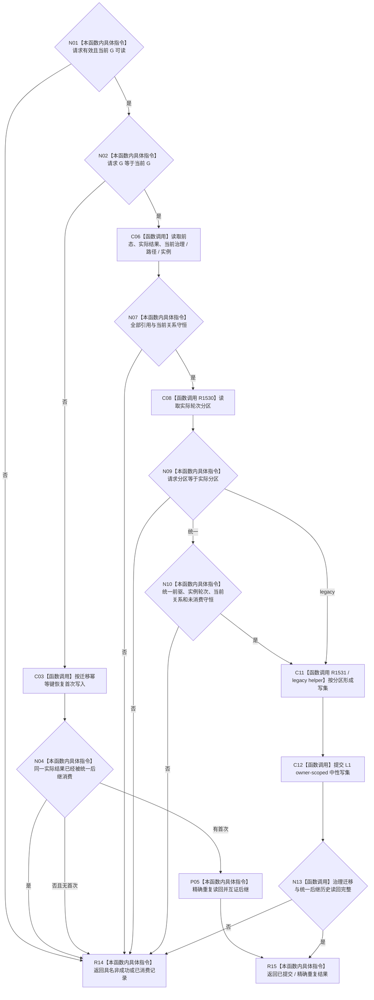

# CF-L4-0188 提交目标未达成待重筹办迁移现状流程图

图类型：现状流程图
代码版本：`dd8a7810693b7892b3265333f762b7c1c3bcd4d8`；源码 blob：`6e28721b63e27f96abc2abb6e9335c40484b9afc`
覆盖文件：`海中鱼巣/领域/服务.L2任务结构.ixx:7264-7587`
唯一根函数：R1528
完整签名：`L2提交目标未达成待重筹办迁移结果 海中鱼巣::L2任务结构服务::提交目标未达成待重筹办迁移(L2提交目标未达成待重筹办迁移请求 请求) noexcept`
参数：待重筹办迁移请求；统一分区还携带权威推进材料。
返回结果：已提交 / 精确重复迁移、已消费后继记录，或具名非成功。
调用图：`流程图/主程序可达调用关系/07_任务统一筹办轮次权威当前调用子图.md`；逐行映射表：同目录配对文件。
验证输出：静态源码复核；运行验证未执行
不得作为施工许可：是

