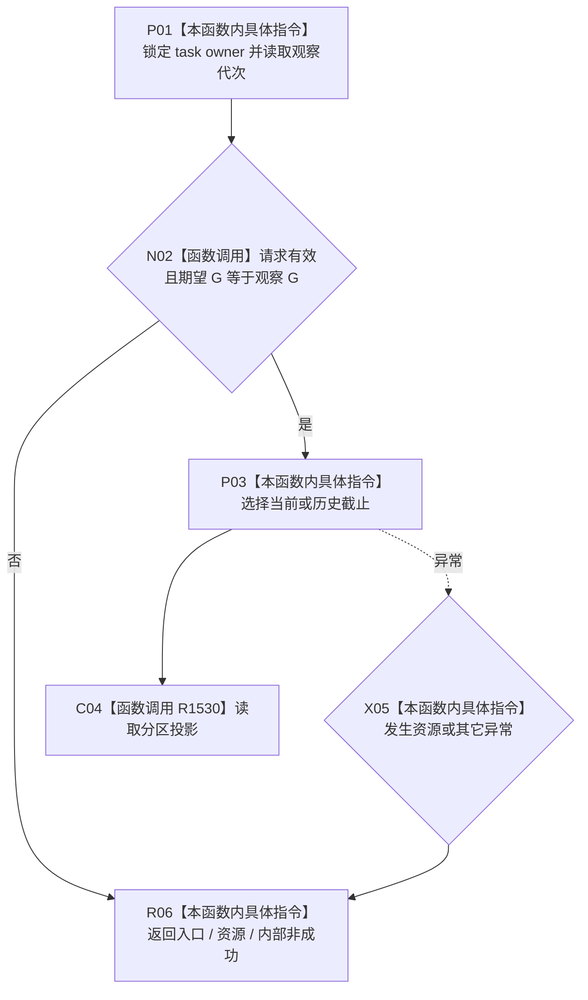

# CF-L4-0189 按任务读取筹办轮次分区现状流程图

图类型：现状流程图
代码版本：`dd8a7810693b7892b3265333f762b7c1c3bcd4d8`；源码 blob：`6e28721b63e27f96abc2abb6e9335c40484b9afc`
覆盖文件：`海中鱼巣/领域/服务.L2任务结构.ixx:5560-5583`
唯一根函数：R1529
完整签名：`L2按任务读取筹办轮次分区结果 海中鱼巣::L2任务结构服务::按任务读取筹办轮次分区(L2按任务读取筹办轮次分区请求 请求) const noexcept`
参数：当前或历史分区读取请求。
返回结果：统一轮次权威及当前准备、legacy 分区，或具名非成功。
调用图：`流程图/主程序可达调用关系/07_任务统一筹办轮次权威当前调用子图.md`；逐行映射表：同目录配对文件。
验证输出：静态源码复核；运行验证未执行
不得作为施工许可：是

